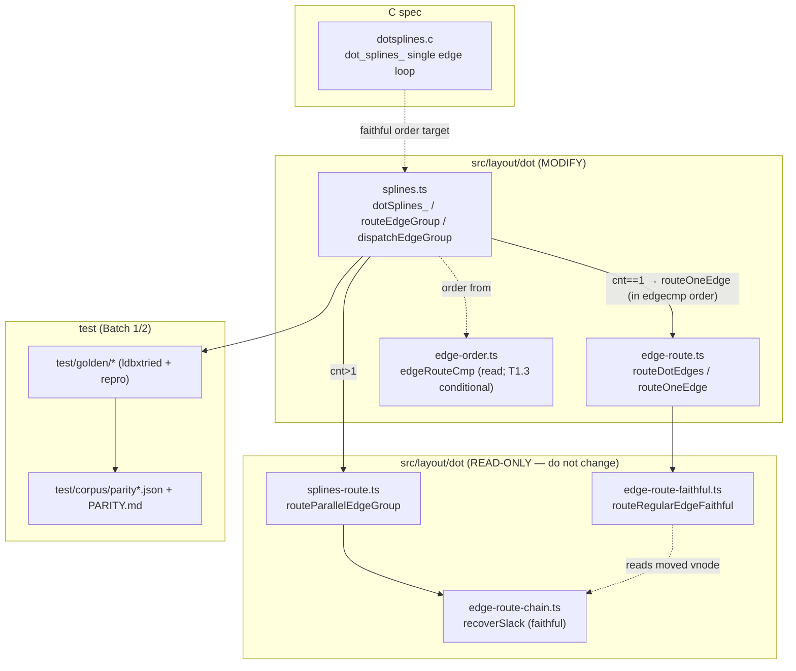

<!-- SPDX-License-Identifier: EPL-2.0 -->

# Component map — affected modules

**Change locus:** `splines.ts` + `edge-route.ts` fold the two passes into one
`edgecmp` loop (ADR-3 / Option A). `edge-order.ts` is read-only unless T0.3 finds
the comparator diverges (T1.3). `routeParallelEdgeGroup`, `routeRegularEdgeFaithful`,
and `recoverSlack` are correct and must not change (ADR-5 STOP if they must).
