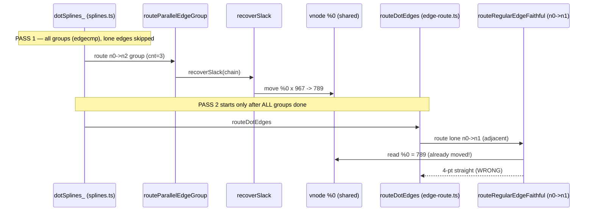
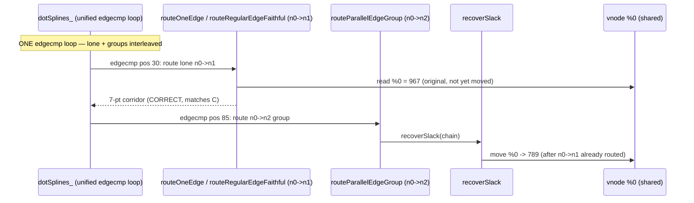

<!-- SPDX-License-Identifier: EPL-2.0 -->

# Data flow — edge routing order

## Current (buggy) two-pass order

```mermaid
sequenceDiagram
    participant DS as dotSplines_ (splines.ts)
    participant RPG as routeParallelEdgeGroup
    participant RS as recoverSlack
    participant VN as vnode %0 (shared)
    participant RDE as routeDotEdges (edge-route.ts)
    participant RRF as routeRegularEdgeFaithful (n0->n1)

    Note over DS: PASS 1 — all groups (edgecmp), lone edges skipped
    DS->>RPG: route n0->n2 group (cnt=3)
    RPG->>RS: recoverSlack(chain)
    RS->>VN: move %0  x 967 -> 789
    Note over DS,RDE: PASS 2 starts only after ALL groups done
    DS->>RDE: routeDotEdges
    RDE->>RRF: route lone n0->n1 (adjacent)
    RRF->>VN: read %0 = 789  (already moved!)
    RRF-->>RDE: 4-pt straight (WRONG)
```

## Target (C-faithful) single-pass order

```mermaid
sequenceDiagram
    participant DS as dotSplines_ (unified edgecmp loop)
    participant RRF as routeOneEdge / routeRegularEdgeFaithful (n0->n1)
    participant RPG as routeParallelEdgeGroup (n0->n2)
    participant RS as recoverSlack
    participant VN as vnode %0 (shared)

    Note over DS: ONE edgecmp loop — lone + groups interleaved
    DS->>RRF: edgecmp pos 30: route lone n0->n1
    RRF->>VN: read %0 = 967  (original, not yet moved)
    RRF-->>DS: 7-pt corridor (CORRECT, matches C)
    DS->>RPG: edgecmp pos 85: route n0->n2 group
    RPG->>RS: recoverSlack(chain)
    RS->>VN: move %0 -> 789  (after n0->n1 already routed)
```
