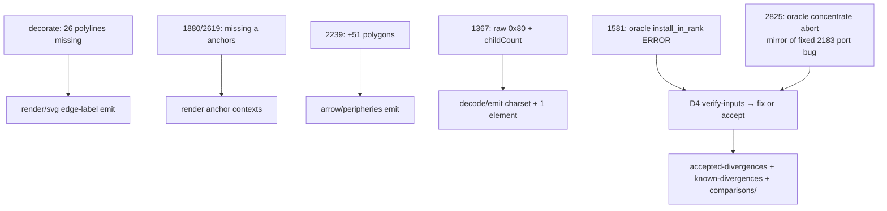

<!-- SPDX-License-Identifier: EPL-2.0 -->
# Element-count bucket — cause map

```mermaid
graph TD
  DEC[decorate: 26 polylines missing] --> EMIT[render/svg edge-label emit]
  ANC[1880/2619: missing a anchors] --> URL[render anchor contexts]
  P51[2239: +51 polygons] --> ARR[arrow/peripheries emit]
  B80[1367: raw 0x80 + childCount] --> CHARSET[decode/emit charset + 1 element]
  OB1[1581: oracle install_in_rank ERROR] --> DISPO[D4 verify-inputs → fix or accept]
  OB2[2825: oracle concentrate abort<br/>mirror of fixed 2183 port bug] --> DISPO
  DISPO --> REG[accepted-divergences + known-divergences + comparisons/]
```
