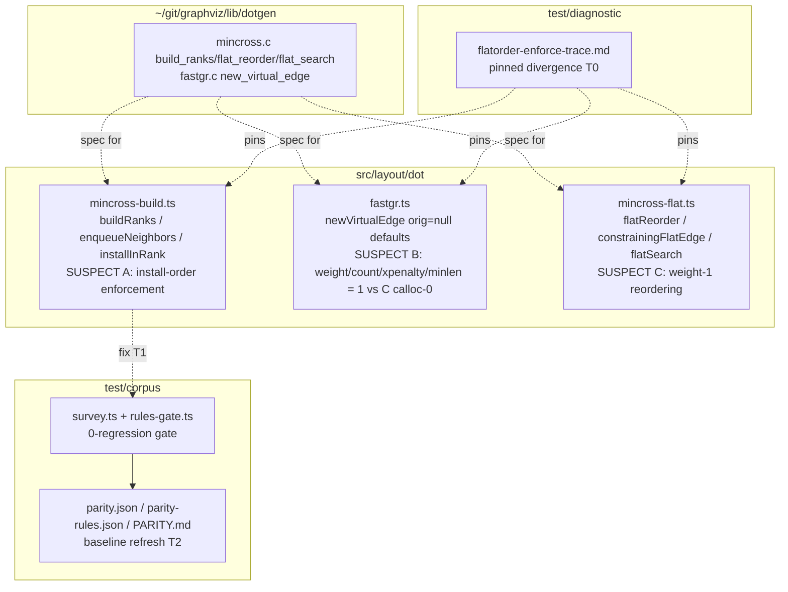

# Component map — affected components

Write-set is decided by T0: the fix lands in `mincross-build.ts` (install order)
and/or `fastgr.ts` (orig=null defaults) and/or `mincross-flat.ts` (weight handling).
The baseline files refresh in T2.
