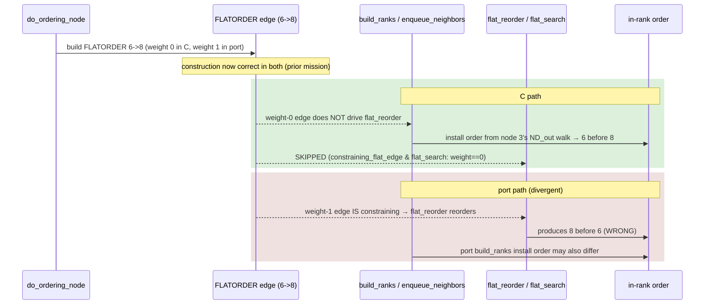

# Data flow — FLATORDER enforcement: C vs port

How a built FLATORDER constraint (e.g. `6->8` from node 3's `ordering=out`) is
turned into in-rank order, and where C and the port diverge.

Batch 0 (T0) captures BOTH the post-build_ranks install order and the
post-flat_reorder order, in C and port, to localize whether the flip happens in
`build_ranks` (install order) or in `flat_reorder` (weight-1 reordering) — the two
SUSPECT sites Batch 1 will target.
