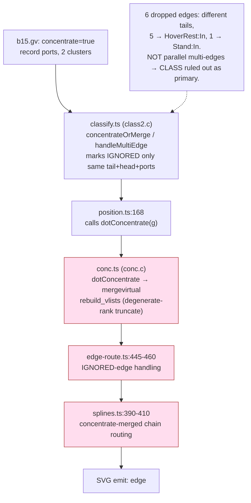

<!-- SPDX-License-Identifier: EPL-2.0 -->
# Component map — concentrate edge path

The concentrate path the 6 dropped edges flow through. Batch 1 instruments each
hop to find where the port first diverges from C.

C invariant (the spec): `dot_concentrate` merges only VIRTUAL nodes that share
tail/head AND pass `portcmp`; it never deletes original edges, so `dotsplines`
emits all 153. The port drops 6 — the defect is in a suspect node (pink) above.
