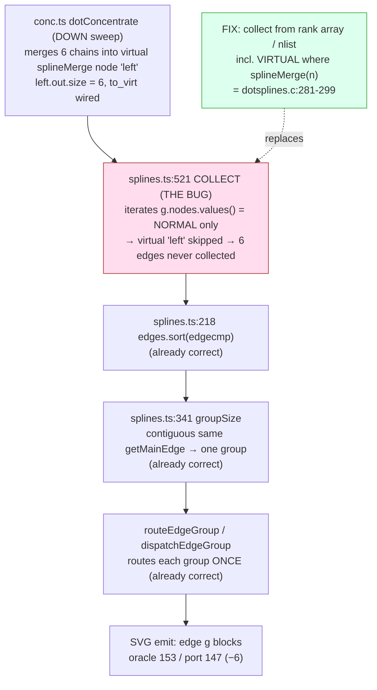

<!-- SPDX-License-Identifier: EPL-2.0 -->
# Component map — the collect + group dispatch

The fix is in `dotSplines_`'s collect. Everything else (sort, group, route)
already exists and is correct.

C spec: `dot_splines_` collects from `GD_rank`/`GD_nlist` including virtual nodes
when `spline_merge(n)` (`dotsplines.c:281-299`), sorts by `edgecmp`, groups by
`getmainedge`, routes each group once (`:328-383`). The port matches every hop
EXCEPT the collect. The prior attempt bypassed the group loop with a side router
→ doubled beziers; the fix routes the new edges through the existing loop so each
`getMainEdge` group routes once.
