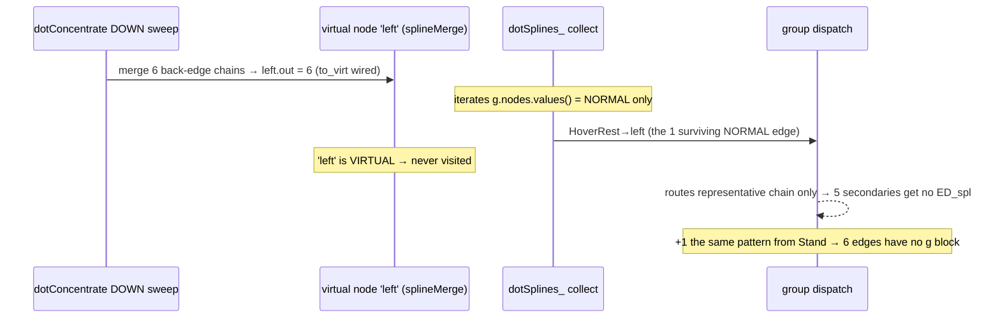
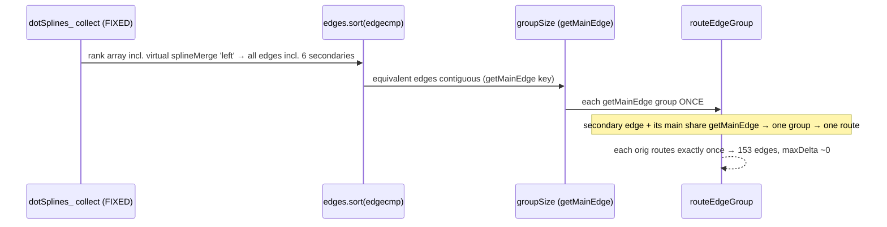

<!-- SPDX-License-Identifier: EPL-2.0 -->
# Data flow — why 6 edges drop, and route-once

## The drop (current port)

## The faithful fix (route-once via getMainEdge)

The trap: the prior side-router visited an orig from BOTH the NORMAL tail and the
merge node → two clip_and_install → doubled bezier. Grouping by `getMainEdge`
(C's model) coalesces them into one route.
