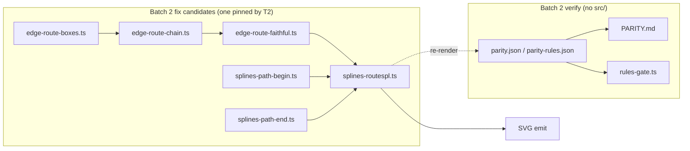

# Component map — affected modules

```mermaid
graph LR
  subgraph candidates["Batch 2 fix candidates (one pinned by T2)"]
    boxes[edge-route-boxes.ts]
    chain[edge-route-chain.ts]
    faithful[edge-route-faithful.ts]
    routespl[splines-routespl.ts]
    pend[splines-path-end.ts]
    pbegin[splines-path-begin.ts]
  end
  boxes --> chain --> faithful --> routespl --> svg[SVG emit]
  pbegin --> routespl
  pend --> routespl

  subgraph verify["Batch 2 verify (no src/)"]
    parity[parity.json / parity-rules.json]
    dash[PARITY.md]
    gate[rules-gate.ts]
  end
  routespl -. re-render .-> parity --> gate
  parity --> dash
```

Only **one** candidate becomes the Batch 2 write-set, pinned by T2's root cause.
The rest are read-only context.
