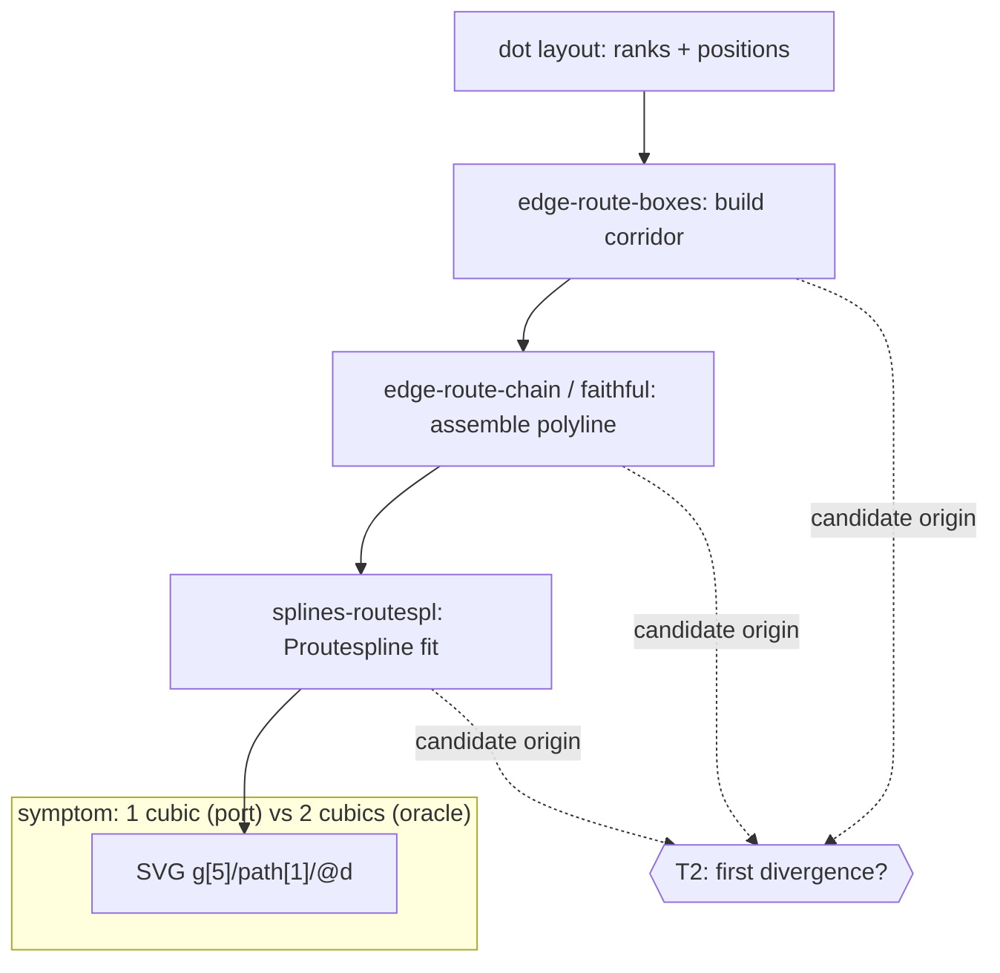
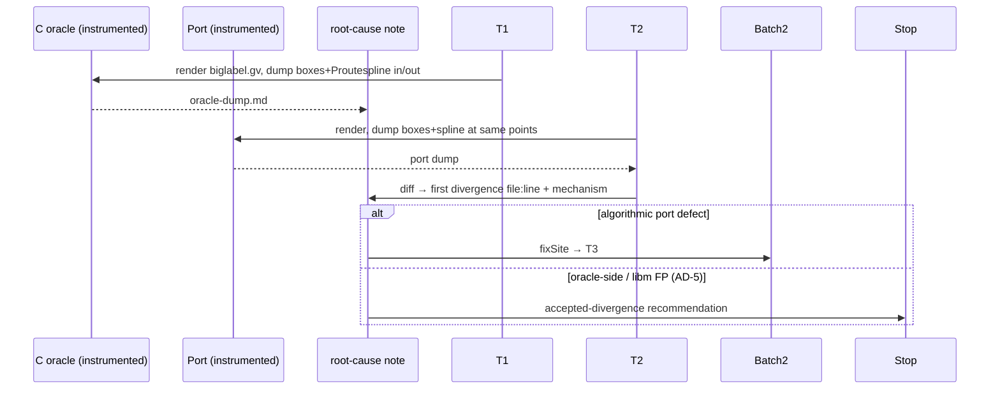

# Data flow — diagnosis & fix

## Edge-spline pipeline (where the divergence lives)

```mermaid
flowchart TD
  A[dot layout: ranks + positions] --> B[edge-route-boxes: build corridor]
  B --> C[edge-route-chain / faithful: assemble polyline]
  C --> D[splines-routespl: Proutespline fit]
  D --> E["SVG g[5]/path[1]/@d"]
  subgraph divergence["symptom: 1 cubic (port) vs 2 cubics (oracle)"]
    E
  end
  B -. "candidate origin" .-> X{{T2: first divergence?}}
  C -. "candidate origin" .-> X
  D -. "candidate origin" .-> X
```

## Diagnosis sequence

```mermaid
sequenceDiagram
  participant C as C oracle (instrumented)
  participant P as Port (instrumented)
  participant N as root-cause note
  T1->>C: render biglabel.gv, dump boxes+Proutespline in/out
  C-->>N: oracle-dump.md
  T2->>P: render, dump boxes+spline at same points
  P-->>T2: port dump
  T2->>N: diff → first divergence file:line + mechanism
  alt algorithmic port defect
    N->>Batch2: fixSite → T3
  else oracle-side / libm FP (AD-5)
    N->>Stop: accepted-divergence recommendation
  end
```
