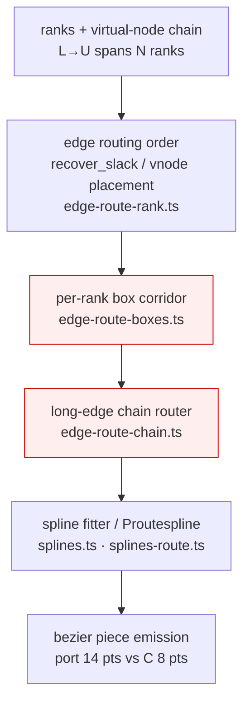
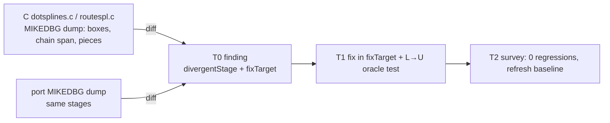

<!-- SPDX-License-Identifier: EPL-2.0 -->
# Component map — mike L→U routing surface

The diagnostic targets the dot edge-spline pipeline. Batch 0 walks it stage by
stage to find the first C-vs-port divergence.

Primary suspect: `edge-route-chain.ts` (long-edge segmentation) and the box
corridor it consumes. Confirmed/redirected by Batch 0.
