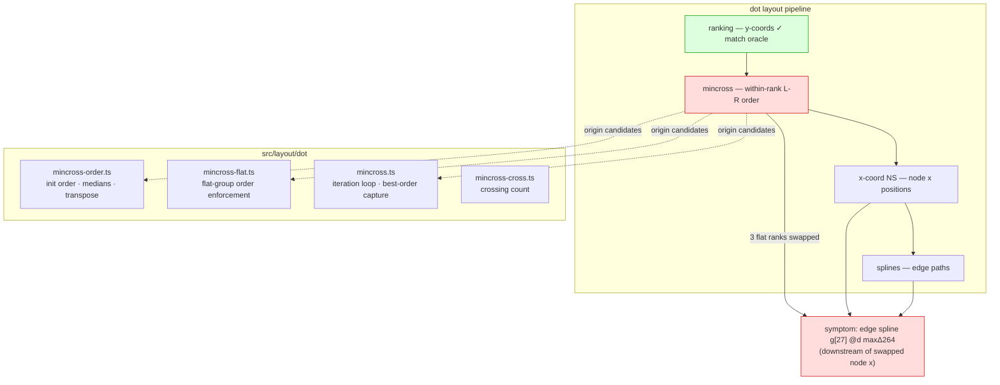

<!-- SPDX-License-Identifier: EPL-2.0 -->
# Component map

The fault is in `mincross` (one of the three candidate files); everything
downstream (x-coord, splines) is faithful and merely propagates the swapped node
order into the reported edge-spline delta.
