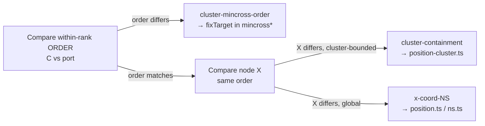

<!-- SPDX-License-Identifier: EPL-2.0 -->
# Component map — ldbxtried X-divergence suspect surface

The dot layout pipeline stages that set node X. The divergence is horizontal
(ranks/Y are correct), so the suspect stages are mincross ordering → x-coord NS →
cluster containment. Batch 0 pins which one.

```mermaid
flowchart TD
  parse[parse DOT + build cluster model] --> rank[rank assignment (Y)\nranks MATCH — out of scope]
  rank --> mincross[mincross: within-rank L→R order\nmincross*.ts / mincross-cluster*.ts\nSUSPECT 1 — n518 reorder]
  mincross --> xcoord[x-coord network simplex\nposition.ts / ns.ts LR_balance\nSUSPECT 2 — node X spacing]
  xcoord --> contain[cluster containment / margin\nposition-cluster.ts\nSUSPECT 3 — cluster x-extent]
  contain --> splines[edge spline routing\nDOWNSTREAM — 48 edges reroute]
  splines --> emit[SVG emit]

  classDef suspect fill:#fde,stroke:#b36;
  class mincross,xcoord,contain suspect;
```

## Affected nodes (Batch 0 focus)
- n454 (Δ323), n449 (Δ210), n518 (Δ203, reorders in rank y=−38), n526, n513,
  n500, n496, n474 — all **X-only** (cy/rank identical to C).

## Decision flow

