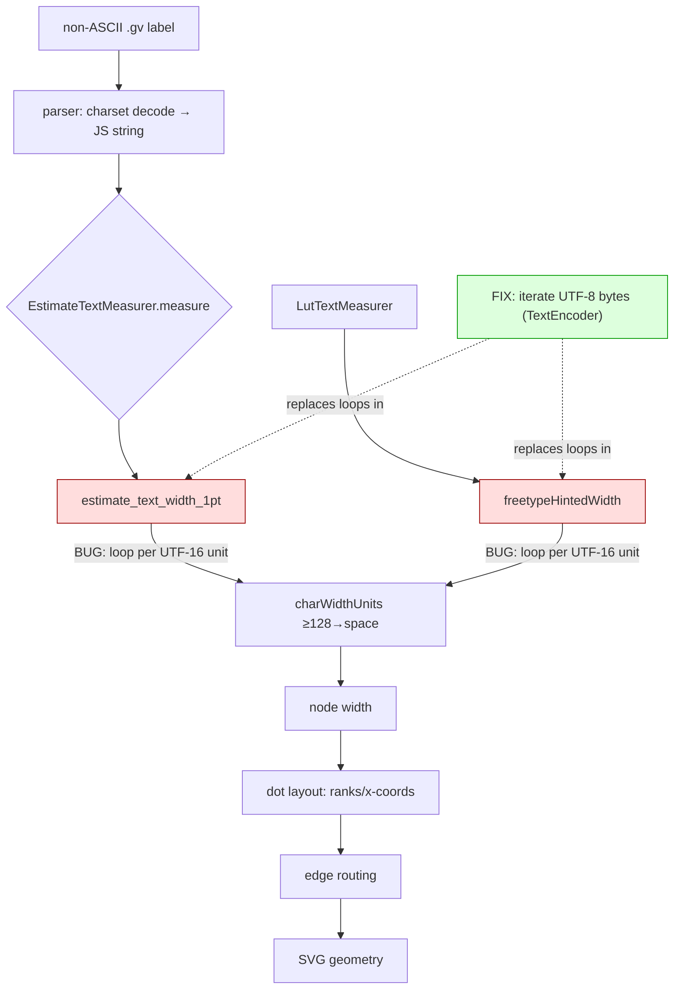

<!-- SPDX-License-Identifier: EPL-2.0 -->
# Component map

C spec: `lib/common/textspan_lut.c:estimate_text_width_1pt` loops per byte
(`(unsigned char)*c`); `estimate_character_width_canonical` maps byte ≥128 →
space. The port must do the same after re-encoding the decoded JS string to UTF-8.
