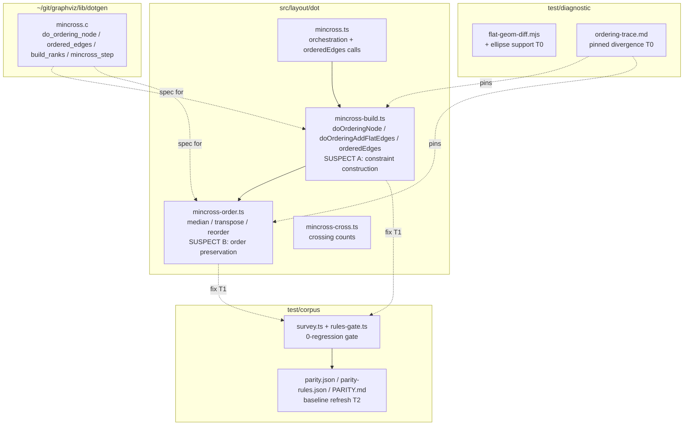

# Component map — affected components

Write-set is decided by T0: the fix lands in `mincross-build.ts` (Suspect A)
and/or `mincross-order.ts` (Suspect B). `flat-geom-diff.mjs` gets the ellipse fix
in T0; the baseline files refresh in T2.
