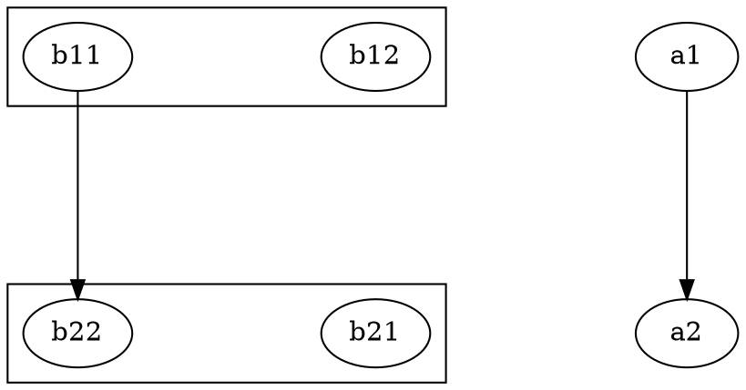

# T1 Investigation — dot pack-branch wiring + cluster oracle

## Evidence sources

- C spec: `~/git/graphviz/lib/dotgen/dotinit.c` (doDot, initSubg, copyCluster,
  copyClusterInfo), `~/git/graphviz/lib/pack/ccomps.c` (mapClust, cccomps,
  projectG, subGInduce)
- Port: `src/layout/dot/index.ts`, `src/layout/dot/init.ts`,
  `src/layout/pack/index.ts`, `src/common/postproc.ts`
- Probe script: confirmed initSubg need and packCall params (see Q1/Q2 below)

---

## Q1 — initSubg need (ADR-2)

**Finding: `initSubgNeeded: true`**

`buildSubgraph` (pack/index.ts:274) creates a component subgraph with:
- `sg.parent = root`, `sg.root = root.root` — correct parent chain
- `sg.attrs = new Map()` (constructor) — **empty**; no inheritance of root attrs

When `dotPhaseInit(sg)` → `dotGraphInit(sg)` runs, it calls:
```typescript
const p = g.attrs.get('rankdir');   // sg.attrs is empty → undefined
g.info.rankdir = (rankdir << 2) | rankdir;  // defaults to RANKDIR_TB (0)
parseSepAttrs(g);   // reads sg.attrs.get('nodesep') → undefined → default 18
                    // reads sg.attrs.get('ranksep') → undefined → default 36
g.info.concentrate = mapbool(g.attrs.get('concentrate'));  // undefined → false
```

**Probe output (probe-t1.ts):**
```
Root with rankdir=LR: g.info.rankdir = 5 (LR<<2|LR)
Component "c_0": rankdir before=0, after dotGraphInit=0
  (want 5 to match root, sg.attrs.get('rankdir')=undefined)
Component "c_1": rankdir before=0, after dotGraphInit=0
  (same: empty attrs → wrong default for explicit-rankdir roots)
```

For 2458 specifically (no explicit rankdir/nodesep/ranksep), defaults coincidentally
match — but the port needs `initSubg` for correctness in the general case (any root
with explicit `rankdir`, `nodesep`, `ranksep`, or `concentrate` attrs).

Note: `commonInitNode` reads `g.root.info.flip` (not `g.info.flip`), so the node
sizing done during `dotInitNodeEdge(sg)` is safe regardless. The ranking passes
(`dotRank`, `dotPosition`) DO read `sg.info.nodesep`/`ranksep`/`rankdir`, so
those must be correct before rank computation.

**Implementation ordering:** `dotGraphInit(sg)` FIRST (reads empty attrs → wrong
values), then `initSubg(sg, root)` to OVERRIDE with root's parsed values:
```typescript
function initSubg(sg: Graph, root: Graph): void {
  sg.info.nodesep = root.info.nodesep;
  sg.info.ranksep = root.info.ranksep;
  sg.info.rankdir = root.info.rankdir;
  sg.info.flip    = root.info.flip;
  sg.info.concentrate = root.info.concentrate;
  // quantum/dpi from drawing (C initSubg copies these); ratioKind = 'none'
  // for all components (C never passes ratio_kind to subgraphs).
  if (root.info.drawing) {
    sg.info.drawing = makeDrawing({
      quantum: root.info.drawing.quantum,
      dpi:     root.info.drawing.dpi,
      ratioKind: 'none',
    });
  }
}
```

C counterpart (`dotinit.c:344-356`):
```c
static void initSubg(Agraph_t *sg, Agraph_t *g) {
    agbindrec(sg, "Agraphinfo_t", ...);
    GD_drawing(sg)->quantum = GD_drawing(g)->quantum;
    GD_drawing(sg)->dpi     = GD_drawing(g)->dpi;
    GD_gvc(sg)      = GD_gvc(g);
    GD_charset(sg)  = GD_charset(g);
    GD_rankdir2(sg) = GD_rankdir2(g);
    GD_nodesep(sg)  = GD_nodesep(g);
    GD_ranksep(sg)  = GD_ranksep(g);
    GD_fontnames(sg)= GD_fontnames(g);
}
```

`gvc` / `charset` / `fontnames` are handled by other mechanisms in the port; only
`rankdir2`, `nodesep`, `ranksep`, `flip`, `concentrate`, and (optionally) `drawing`
quantum/dpi are material.

---

## Q2 — packCall params

**Finding: `packCall: { mode: l_graph, margin: 1, doSplines: true }`**

Probe trace for `digraph { pack=1; q16; q1 -> q2[label=connected] }`:

```
getPack(g, -1, 8):
  pack attr = '1'; parseInt('1') = 1 >= 0 → returns 1   → Pack = 1

getPackModeInfo(g, PackMode.Undef, pinfo):
  packmode attr = undefined → '' → no keyword match → returns PackMode.Undef
  → mode = PackMode.Undef

getPackInfo(g, PackMode.Node, 8, pinfo):
  pinfo.margin = getPack(g, 8, 8) = 1  (pack='1' → 1 >= 0)
  pinfo.mode   = getPackModeInfo(g, PackMode.Node, pinfo) = PackMode.Undef

doDot branch:
  mode == PackMode.Undef → pinfo.mode = PackMode.Graph  (l_graph)
  Pack (=1) >= 0         → pinfo.margin = 1
  pinfo.doSplines = true (set before per-component loop)
```

**Probe output (probe-t1.ts):**
```
Pack = 1 (expect 1)
mode from getPackModeInfo(Undef) = 0 (PackMode.Undef=0)
pinfo after getPackInfo: {"margin":1,"doSplines":false,"mode":2,...}
pinfo after doDot branch (final): {"margin":1,"doSplines":true,"mode":3,...}
  mode: 3 (PackMode.Graph=3)
```

Confirmed: `mode=PackMode.Graph (3)`, `margin=1`, `doSplines=true`.

---

## Q3 — Root finalization

**Finding: root does NOT re-run `dotLayoutPipeline`.**

C flow (`dotinit.c:437-508`, `dot_layout:510-518`):
```
doDot(g):
  for each sg in comps: initSubg(sg); dotLayout(sg);  // per-component layout
  attachPos(g); packSubgraphs(...); resetCoord(g);
  copyClusterInfo(ncc, ccs, g);
dot_layout(g):
  doDot(g);
  dotneato_postprocess(g);  // ← called ONCE on root after packing
```

C's `dotLayout` does NOT call `dotneato_postprocess`; that's called once on root
by `dot_layout`. The port's `dotLayoutPipeline` includes `gvPostprocess` inside
`dotPhasePost`. So for the pack branch:

- Per-component: run `dotLayoutComponent(sg)` — everything in `dotLayoutPipeline`
  except `gvPostprocess(sg)` (see below)
- After packing: `gvPostprocess(g)` once on root

Calling `gvPostprocess(sg)` per-component would normalize each component's coords
to (0,0) then rotate by rankdir — but packing then shifts those, and a second
`gvPostprocess(g)` on root would double-rotate, corrupting LR/BT/RL coords.

**Root bbox source:** `packSubgraphs` (pack/index.ts:152-156) calls
`computeSubgraphBB(root, 0)` at the end → `root.info.bb` is set. `gvPostprocess(g)`
then uses `root.info.bb.ll` as the translate offset.

**Root-level post-steps required:**
- `gvPostprocess(g)` — xlabels, root label, coordinate normalization (MUST run)
- No `dotLayoutPipeline(root)` re-run (root is never re-ranked)
- No separate `removeFill`/`dotSplines`/etc on root (those run per-component)

**`dotLayoutComponent(sg)` structure** (no `gvPostprocess`):
```typescript
function dotLayoutComponent(sg: Graph, root: Graph): void {
  dotGraphInit(sg);                     // reads empty attrs
  initSubg(sg, root);                   // override with root's parsed values
  setEdgeTypeFromAttr(sg, EDGETYPE_SPLINE);
  setAspect(sg);
  dotInitSubg(sg);
  dotInitNodeEdge(sg);
  dotRank(sg);
  dotMincross(sg);
  dotPosition(sg);
  removeFill(sg);
  dotSameports(sg);
  dotSplines(sg);
  if (mapbool(sg.attrs.get('compound'))) dotCompoundEdges(sg);
  // NO gvPostprocess here — called once on root after packSubgraphs
}
```

---

## Q4 — ratio guard

**Finding: guard reads `ratio` attr via `parseRatioKind(g)` logic.**

C guard (`dotinit.c:472`): `GD_drawing(g)->ratio_kind == R_NONE`.

Port mapping:
- `parseRatioCompress` in `init.ts` only sets `g.info.drawing` for `ratio=compress`
- All other ratios (`fill`, `expand`, `value`, `auto`) leave `g.info.drawing = undefined`
- No-ratio case also leaves `drawing = undefined`

Checking only `!g.info.drawing` would incorrectly activate the pack branch for
`ratio=fill/expand/value/auto` (drawing is undefined for those), which C does NOT
do (those cases fall through to whole-graph layout).

**Correct guard implementation** (reads attr directly, like C's `setRatio`):
```typescript
function ratioIsNone(g: Graph): boolean {
  const p = g.attrs.get('ratio');
  if (!p || p === '') return true;
  if (p === 'auto' || p === 'compress' || p === 'expand' || p === 'fill') return false;
  return !(Number.parseFloat(p) > 0);   // positive numeric → R_VALUE → not NONE
}
```

For 2458 (no ratio attr): `ratioIsNone = true` → pack branch fires ✓.

**Probe output:**
```
g.info.drawing = undefined  (no ratio attr in 2458)
ratioIsNone (pack branch fires): true  ✓
```

`ratioGuardField`: `g.info.drawing?.ratioKind` captures the compress case but is
insufficient alone — `ratioIsNone(g)` (direct attr read) is the authoritative guard.

---

## Q5 — Cluster carry + oracle

**Finding: `clusterCarryNeeded: true`**

**Port's `cccomps` vs C's `cccomps`:**

C's `cccomps` (ccomps.c:437) calls `subGInduce(g, out)` after collecting component
nodes. `subGInduce` → `subgInduce(root, component, 0)` → iterates all root
subgraphs, calls `projectG(subg, component, inCluster)` for each. `projectG`
clones the cluster subgraph into the component (if any of its nodes are in the
component), stores `op->orig = subg` (the ORIG_REC "back pointer"), and copies
attrs. `mapClust(cl)` then reads `op->orig` to map component-clone cluster back
to the root cluster.

The port's `cccomps` (pack/index.ts:293-303) does only a DFS `dfsCollect` +
`buildSubgraph` — no `subGInduce`/`projectG`. Result: component subgraphs have
`sg.info.n_cluster = 0`, `sg.info.clust = undefined`. `dotLayoutPipeline(sg)`
cannot build cluster rank constraints or cluster BBs.

For 2458 (no clusters): no impact.
For any root with clusters AND ≥2 components: cluster layout is absent → wrong
ranks and BBs.

**Dot-local cluster carry (ADR-3):** `pack-components.ts` must:
1. After `cccomps(g, pfx)`, for each component `sg`, project root's cluster
   subgraphs into `sg` (re-implement `subGInduce`/`projectG`) AND store the
   component-cluster → root-cluster mapping.
2. After per-component layout, call a `copyClusterInfo` port that reads
   `GD_bb`, `GD_label_pos`, `GD_border`, `GD_n_cluster`, `GD_label` from
   the component's cluster clones and writes them to the root clusters.
   Uses the stored back-pointer (TS equivalent of ORIG_REC).

**Cluster oracle case: corpus `2592`** (already diverged, maxDelta=564).

Graph structure of 2592:


Components:
- Comp-0: {a1, a2} — connected via a1→a2, no clusters
- Comp-1: {b12, b11, b22, b21} — connected via b12→b21 and b11→b22;
  carries cluster_b1 and cluster_b2

2592 exercises: multi-component pack path (pack=100, array_3 mode) AND cluster
carry (cluster_b1/b2 in comp-1). Status: diverged, in corpus already — no new
test infrastructure required for T3 beyond adding it to the golden test.

---

## Q6 — No-pack path

**Finding: `dotLayoutPipeline(g)` is called unchanged when
`mode === PackMode.Undef && Pack < 0`.**

C (`dotinit.c:445-452`):
```c
if (mode == l_undef && Pack < 0) {
    dotLayout(g);   // whole-graph layout
    // then dot_layout calls dotneato_postprocess(g) after doDot returns
}
```

Port: `dotLayoutPipeline(g)` = C's `dotLayout(g)` + `dotneato_postprocess(g)` in
one call. The no-pack path in `dotLayoutEntry` → `doDot` checks:
```typescript
if (mode === PackMode.Undef && Pack < 0) {
  dotLayoutPipeline(g);
  return;
}
```

Also applies to `ncc === 1` (single component) and `!ratioIsNone(g)` (ratio set)
cases — all fall through to `dotLayoutPipeline(g)` unchanged.

---

## Write-set assessment

All changes confined to:
- `src/layout/dot/index.ts` — `dotLayoutEntry` adds doDot wrapper; all other
  exported functions (`dotLayoutPipeline`, `dotPhaseInit`, `dotPhasePost`, etc.)
  are **unchanged**
- `src/layout/dot/pack-components.ts` (new) — `initSubg`, `dotLayoutComponent`,
  `runPackBranch`, cluster-carry helpers, `copyClusterInfo`

No changes needed to:
- `src/layout/pack/**` — `packSubgraphs`/`cccomps`/`shiftGraphs` work as-is;
  shiftOneGraph already shifts `n.info.coord` (points) and `shiftEdgePoints`
  handles `doSplines=true` spline shifting
- `src/layout/twopi/**` — untouched per ADR-3

`attachPos`/`resetCoord` are NOT needed: the port's pack module works in points
(`n.info.coord`) already.

---

## Interface contract

```
initSubgNeeded: true   # empty sg.attrs → dotGraphInit reads defaults not root values;
                       # probe: root rankdir=5 but component gets 0 without seed
packCall: { mode: l_graph, margin: 1, doSplines: true }
rootRerank: false              # root never re-runs dotLayoutPipeline; bb set by
                               # packSubgraphs→computeSubgraphBB; gvPostprocess
                               # called once on root after packing
ratioGuardField: ratioIsNone(g) — direct attr read (not g.info.drawing which is
                 only set for ratio=compress; fill/expand/value/auto also not NONE)
clusterCarryNeeded: true
clusterOracleCase: 2592        # diverged corpus, pack=100 packmode=array_3,
                               # 2 components, cluster_b1+cluster_b2 in comp-1
fixFiles: src/layout/dot/index.ts, src/layout/dot/pack-components.ts
writeSetAssumptionBroken: false
```
