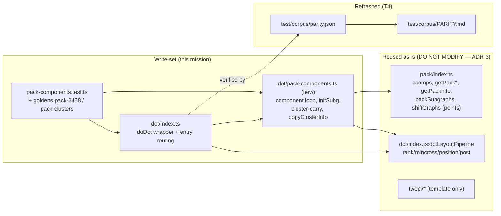

# Component map — touched vs reused

- **index.ts / pack-components.ts** — the only source changes.
- **pack/** and **twopi/** — reused; touching them is a STOP condition.
- **parity.json / PARITY.md** — refreshed in T4 (Estimate+ghl recipe).
