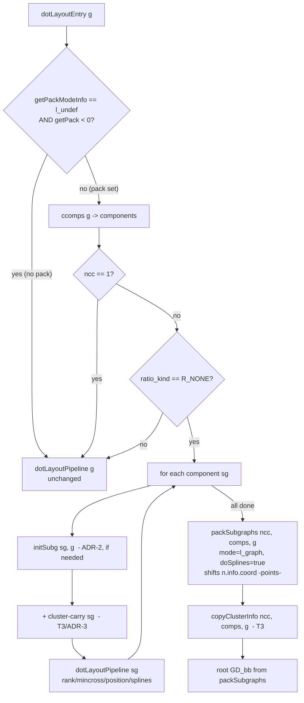

# Data flow — dot `doDot` pack branch

`dotLayoutEntry` routes through a new `doDot` wrapper that mirrors
`lib/dotgen/dotinit.c:doDot`.

Key: the port's `packSubgraphs`→`shiftGraphs` shifts `n.info.coord` in **points**
(not C's inches/`ND_pos`), so `attachPos`/`resetCoord` are unnecessary. The root is
never re-ranked in the pack branch.
