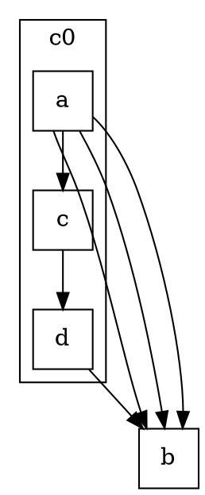

<!-- SPDX-License-Identifier: EPL-2.0 -->

# T0.1 — C `make_regular_edge` ground truth (instrumented oracle)

## Method
- Instrumented `~/git/graphviz/lib/common/routespl.c` `routesplines_` with two
  `getenv("GV_DUMP_MRE")`-gated dumps (clean tree otherwise; reverted after):
  - `[MRE-BOX]` after `checkpath` (before the box x-extents are clobbered at
    routespl.c:444): edge, `boxn`, `pp->start.p`/`pp->end.p`, full box list.
  - `[MRE-PL]` after `Pshortestpath` succeeds: `eps[0]/eps[1]` and the resulting
    `Ppolyline_t pl` points.
- Rebuilt `gvplugin_dot_layout` (pulls `common`+`dotgen`); the headless oracle
  `/tmp/ghl` symlinks the build-tree dylib, so it auto-picks the instrumented
  plugin AND keeps estimate-path positions (golden-matching).
- Render: `GV_DUMP_MRE=1 GVBINDIR=/tmp/ghl ~/git/graphviz/build/cmd/dot/dot -Tsvg`.
- Coordinates below are C's **internal layout frame** (y positive up). The SVG
  applies a constant translation (≈ +29 x, y negated); structure is frame-invariant.

## Headline result — the divergence is PURE ROUTING
`n0` and `n2` are **byte-identical in position** between headless-C and the port
(n0 polygon `351.39,-579.54 … 402.39,-537.94`; n2 ellipse `cx=848.89 cy=-203.39`;
canvas `1111×628` both). So this is NOT a layout/x-coord divergence (unlike the
superseded NaN case in `[[opposing-edge-spline-divergence]]`). It is entirely in
the edge spline.

## Case 1 — `ldbxtried` `n0 -> n2` (×3, all `dir=both`); n0 ∈ cluster0, n2 outside

**C routes the whole cnt=3 group ONCE** (a single `routesplines_` call → a single
MRE dump), then makes the 2 extra copies by shifting only the **interior** spline
points by `Multisep` (dotsplines.c:1885–1907); the endpoints are never shifted.

```
[MRE-BOX] n0->n2 boxn=9 start=(347.00,549.74) end=(819.00,196.39)
  boxes=
    [-112.0,529.9,1169.4,550.7]   rank box (full width)
    [-112.0,493.9,1169.4,529.9]   rank box
    [382.0,452.3,1004.0,493.9]    node bbox (just below n0)
    [-112.0,416.3,1169.4,452.3]   rank box
    [899.0,356.8,1169.4,416.3]    <-- corridor shifts RIGHT (x≥899)
    [-112.0,320.8,1169.4,356.8]   rank box
    [897.0,261.2,1169.4,320.8]    <-- stays right (x≥897)
    [-112.0,225.2,1169.4,261.2]   rank box
    [756.0,195.4,1169.4,225.2]    node bbox (near n2, x≈756..)

[MRE-PL]  n0->n2 eps=(347.00,549.74)->(819.00,196.39) plpn=5
  pl=(347.00,549.74)|(899.00,416.34)|(899.00,356.76)|(897.00,261.18)|(819.00,196.39)
```

- Polyline is the classic **up-right-down**: from the tail it jumps RIGHT to
  x≈899 (around the cluster's right edge), descends at x≈897–899, then into the
  head. `Proutespline` smooths the 5-pt polyline to a **10-pt / 3-bezier** spline.
- Final installed spline (headless SVG, edge2):
  `M414.07,-553.8 C525.19,-542.33 847.71,-504.61 910.89,-424.34
   919.91,-412.88 920.14,-292.52 908.89,-269.18
   900.5,-251.79 884.98,-237.41 871.4,-226.65`  → **10 pts**, ends at the n2
   boundary (871,-226). The two copies (edge3/edge4) are the same shape with
   interior x shifted by ±Multisep (endpoints fixed).

### Port (current `main`) for the same edge — WRONG
```
M413.55,-552.38 C534.45,-536.49 913.82,-490.4 985.53,-483.12   (4 pts / 1 bezier)
head arrowhead polygon at (985.72,-486.61)…(995.38,-482.27)
```
- 4-pt **near-straight** line. Worse than under-segmentation: the head end is at
  **(985,-483)**, far from n2 (848,-203) — the edge never reaches the real head;
  its arrowhead points into empty space. The straight route terminates at what is
  almost certainly the first/last virtual-node x on the corridor, not the head port.

## Case 2 — minimal synthetic repro (`/tmp/repro.gv`)

Ranks: a=0, c=1, d=2, b=3 (`a->b` spans 3 ranks). Reproduces the signature:

```
[MRE-BOX] a->b boxn=7 start=(34.00,233.00) end=(98.00,19.00)
  boxes=[-64,216,174,234][-64,180,174,216][61,144,174,180][-64,108,174,144]
        [61,64,174,108][-64,36,174,64][-64,18,174,36]
[MRE-PL]  a->b eps=(34.00,233.00)->(98.00,19.00) plpn=3
  pl=(34.00,233.00)|(61.00,180.00)|(98.00,19.00)
```
- **C**: one route for cnt=3; 7-box corridor; 3-pt polyline bending at (61,180);
  SVG `M28.36,-215.82 C31.74,-205.67 38.49,-192.42 43,-180 59.47,-134.67
  70.27,-79.42 80.84,-46.84` = **7 pts / 2 bezier**, reaches b (116,-36).
- **Port**: `M37.99,-215.7 C49.45,-199.5 72.21,-176.45 87.42,-167.14` =
  **4 pts / 1 bezier**, ends at (87,-167) — b is at (116,-36); again the edge
  does not reach the head.

## Does C offset the ENDPOINTS before routing, or the boxes? — ANSWERED
**Neither, per-edge.** The `eps` are the plain tail/head ports
(`a->b`: 34,233 → 98,19 = node centers, no `+Multisep`). C routes **one base**
spline from those un-offset ports through the corridor boxes, then for `cnt>1`
shifts only the **interior** points of each copy by `Multisep`
(`dotsplines.c:1885–1900`, loop `k=1 .. size-2`). This **refines ADR-3**: the
"per-edge offset endpoints" framing is inaccurate — C does not re-route each edge,
and does not pre-offset endpoints. The bug is therefore NOT a missing per-edge port
offset (that hypothesis was already disproven for NaN). The bug is that the port's
**base spline is a straight line to the wrong (virtual-node) endpoint** instead of a
corridor route to the real head port.

## Point-count summary
| Case | C polyline | C spline pts | Port spline pts | Port endpoint vs head |
|------|-----------|--------------|-----------------|-----------------------|
| ldbxtried n0->n2 | 5 (up-right-down) | 10 / 3-bez | 4 / 1-bez | ends (985,-483); head n2=(848,-203) — wrong |
| repro a->b | 3 (bends) | 7 / 2-bez | 4 / 1-bez | ends (87,-167); head b=(116,-36) — wrong |

## Hand-off to T0.2
T0.2 must instrument the PORT dispatch for `a->b` (repro) and `n0->n2`
(ldbxtried): identify which dispatch branch handles these cross-rank parallel
groups (`makeStraightEdges` straight `dumb` points vs the corridor router), and
WHY the base spline endpoint becomes the virtual-node x instead of the head port.
Expectation from this dump: the port is NOT calling the per-rank-box corridor
router for the base; it is emitting a straight line whose head endpoint is a
vnode, not the head node port.

## Reproduce
```
# instrument routespl.c (MRE-BOX/MRE-PL gated on GV_DUMP_MRE), then:
cd ~/git/graphviz/build && make gvplugin_dot_layout
GV_DUMP_MRE=1 GVBINDIR=/tmp/ghl ~/git/graphviz/build/cmd/dot/dot -Tsvg \
  ~/git/graphviz/graphs/directed/ldbxtried.gv 2>&1 >/dev/null | grep 'n0->n2'
```
C instrumentation is local/throwaway (not committed to the port).
