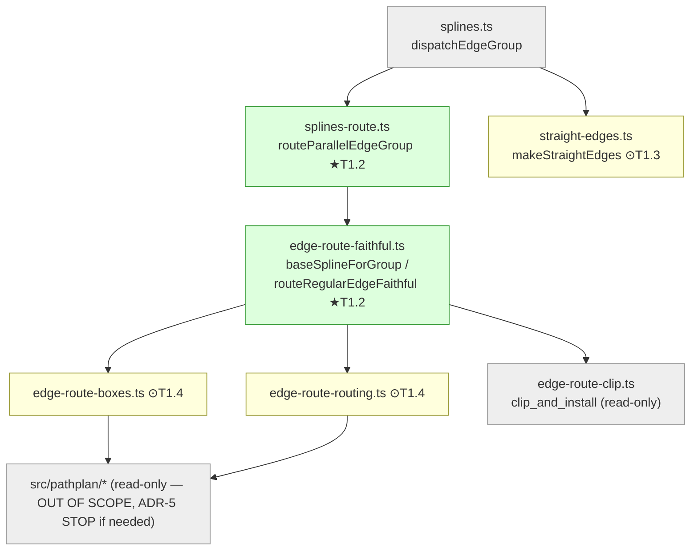

<!-- SPDX-License-Identifier: EPL-2.0 -->

# Component map — affected files

★ = primary fix (T1.2) · ⊙ = conditional on T0.3 (T1.3/T1.4) · grey = read-only.

**Hard boundary (ADR-5):** `src/pathplan/*` is read-only. If Batch 0 finds the fix
needs pathplan changes, STOP and re-plan.
