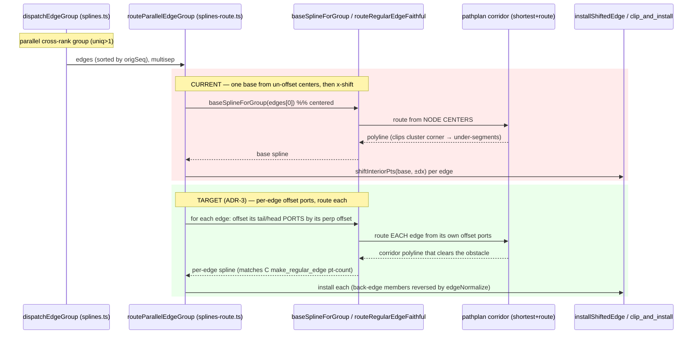
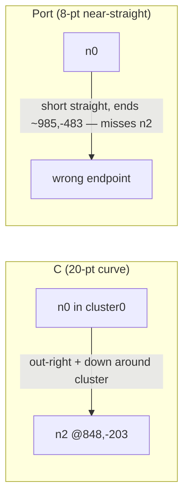

<!-- SPDX-License-Identifier: EPL-2.0 -->

# Data flow — parallel/opposing cross-rank edge routing

## Current (buggy) vs target (faithful)

## ldbxtried symptom (n0 inside cluster0 → n2 outside)

