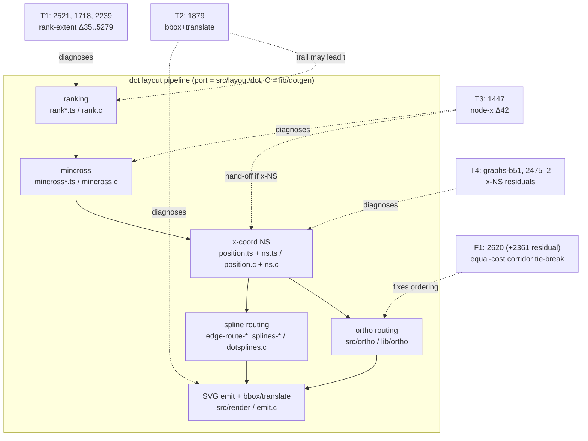

# Component map — where the 8 divergences live

```mermaid
graph TD
    subgraph pipeline["dot layout pipeline (port = src/layout/dot, C = lib/dotgen)"]
        RANK["ranking<br/>rank*.ts / rank.c"] --> MC["mincross<br/>mincross*.ts / mincross.c"]
        MC --> POS["x-coord NS<br/>position.ts + ns.ts / position.c + ns.c"]
        POS --> SPL["spline routing<br/>edge-route-*, splines-* / dotsplines.c"]
        POS --> ORTHO["ortho routing<br/>src/ortho / lib/ortho"]
        SPL --> EMIT["SVG emit + bbox/translate<br/>src/render / emit.c"]
        ORTHO --> EMIT
    end

    T1["T1: 2521, 1718, 2239<br/>rank-extent Δ35..5279"] -.diagnoses.-> RANK
    T3["T3: 1447<br/>node-x Δ42"] -.diagnoses.-> MC
    T3 -.hand-off if x-NS.-> POS
    T4["T4: graphs-b51, 2475_2<br/>x-NS residuals"] -.diagnoses.-> POS
    T2["T2: 1879<br/>bbox+translate"] -.diagnoses.-> EMIT
    T2 -.trail may lead to.-> RANK
    F1["F1: 2620 (+2361 residual)<br/>equal-cost corridor tie-break"] -.fixes ordering.-> ORTHO
```

Every diverged id surfaces as an edge-path `@d` diff (the bucket key), but the
mechanism sits earlier in the pipeline for all except 2620.
