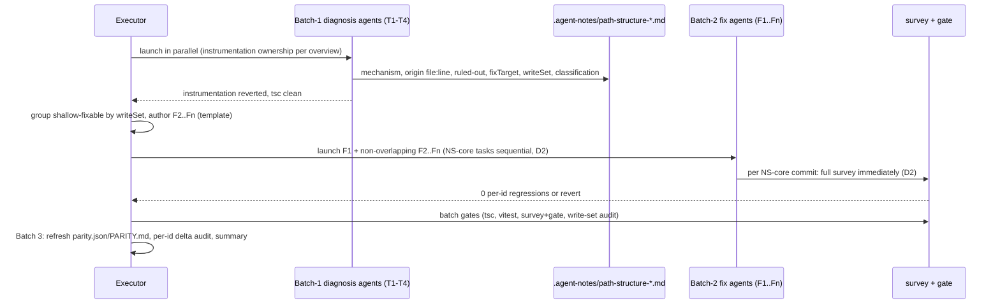

# Mission data flow — diagnosis notes drive fix tasks

```mermaid
sequenceDiagram
    participant E as Executor
    participant D as Batch-1 diagnosis agents (T1-T4)
    participant N as .agent-notes/path-structure-*.md
    participant F as Batch-2 fix agents (F1..Fn)
    participant S as survey + gate

    E->>D: launch in parallel (instrumentation ownership per overview)
    D->>N: mechanism, origin file:line, ruled-out, fixTarget, writeSet, classification
    D-->>E: instrumentation reverted, tsc clean
    E->>E: group shallow-fixable by writeSet, author F2..Fn (template)
    E->>F: launch F1 + non-overlapping F2..Fn (NS-core tasks sequential, D2)
    F->>S: per NS-core commit: full survey immediately (D2)
    S-->>E: 0 per-id regressions or revert
    E->>S: batch gates (tsc, vitest, survey+gate, write-set audit)
    E->>E: Batch 3: refresh parity.json/PARITY.md, per-id delta audit, summary
```
