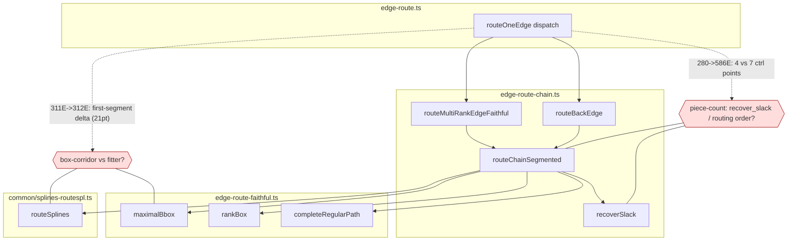

<!-- SPDX-License-Identifier: EPL-2.0 -->
# Component map — root_twopi spline divergence

Candidate origin components (Batch 1 pins the single one). Node positions are
exact, so the divergence is downstream of ranking/position, in edge routing.

**Reading:** `311E->312E` (same point count, first-segment shape off 21pt) points
at the box corridor near the tail (`maximalBbox`) or the fitter
(`routeSplines`/Proutespline). `280->586E` (extra segment) points at piece-count
— `recoverSlack` vnode mutation or `edgecmp` routing order changing the corridor.
Batch 1's box-vs-fitter experiment (equal boxes ⇒ fitter; different boxes ⇒
upstream) disambiguates, exactly as in `plans/fix-1213-splines/`.
