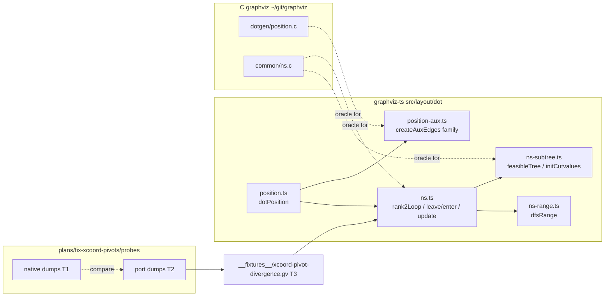

# Component map

Components touched by the mission and how they relate.

```mermaid
graph LR
  subgraph port[graphviz-ts src/layout/dot]
    POS[position.ts<br/>dotPosition]
    AUX[position-aux.ts<br/>createAuxEdges family]
    NS[ns.ts<br/>rank2Loop / leave/enter / update]
    SUB[ns-subtree.ts<br/>feasibleTree / initCutvalues]
    RNG[ns-range.ts<br/>dfsRange]
  end
  subgraph oracle[C graphviz ~/git/graphviz]
    CPOS[dotgen/position.c]
    CNS[common/ns.c]
  end
  subgraph probes[plans/fix-xcoord-pivots/probes]
    PN[native dumps T1]
    PP[port dumps T2]
  end
  FIX[__fixtures__/xcoord-pivot-divergence.gv T3]

  POS --> AUX
  POS --> NS
  NS --> SUB
  NS --> RNG
  CPOS -. oracle for .-> AUX
  CNS -. oracle for .-> NS
  CNS -. oracle for .-> SUB
  PN -. compare .-> PP
  PP --> FIX
  FIX --> NS
```

**Likely fix target (T4):** `position-aux.ts` (aux-edge gap) — fallbacks
`ns-subtree.ts` or `ns.ts`, decided by T3.
