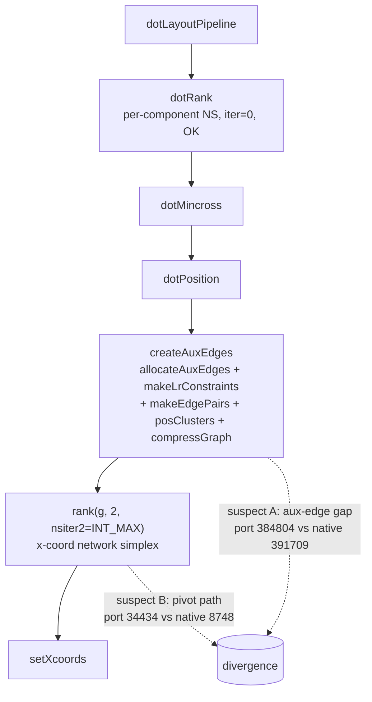
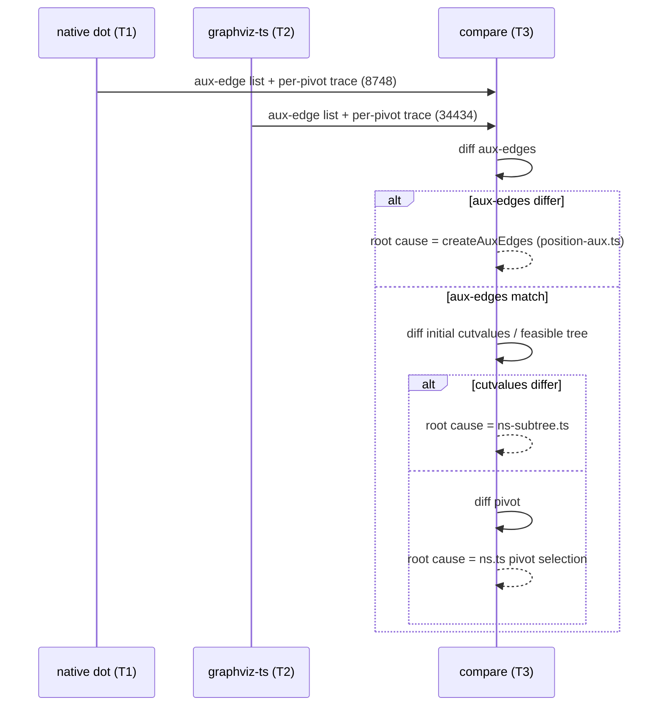

# Data flow — x-coord network simplex

Where the divergence lives in the dot pipeline, and the Batch-1 comparison.

```mermaid
flowchart TD
  A[dotLayoutPipeline] --> B[dotRank<br/>per-component NS, iter=0, OK]
  B --> C[dotMincross]
  C --> D[dotPosition]
  D --> D1[createAuxEdges<br/>allocateAuxEdges + makeLrConstraints<br/>+ makeEdgePairs + posClusters + compressGraph]
  D1 --> D2["rank(g, 2, nsiter2=INT_MAX)<br/>x-coord network simplex"]
  D2 --> D3[setXcoords]
  D1 -. "suspect A: aux-edge gap<br/>port 384804 vs native 391709" .-> X[(divergence)]
  D2 -. "suspect B: pivot path<br/>port 34434 vs native 8748" .-> X
```

```mermaid
sequenceDiagram
  participant N as native dot (T1)
  participant P as graphviz-ts (T2)
  participant C as compare (T3)
  N->>C: aux-edge list + per-pivot trace (8748)
  P->>C: aux-edge list + per-pivot trace (34434)
  C->>C: diff aux-edges
  alt aux-edges differ
    C-->>C: root cause = createAuxEdges (position-aux.ts)
  else aux-edges match
    C->>C: diff initial cutvalues / feasible tree
    alt cutvalues differ
      C-->>C: root cause = ns-subtree.ts
    else
      C->>C: diff pivot #1 leave/enter
      C-->>C: root cause = ns.ts pivot selection
    end
  end
```
