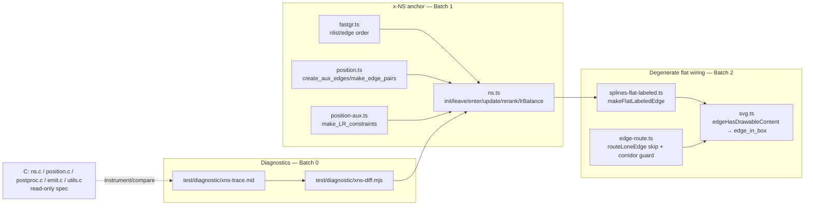

# Affected components

```mermaid
graph LR
  subgraph xNS[x-NS anchor — Batch 1]
    ns[ns.ts<br/>init/leave/enter/update/rerank/lrBalance]
    pos[position.ts<br/>create_aux_edges/make_edge_pairs]
    posa[position-aux.ts<br/>make_LR_constraints]
    fg[fastgr.ts<br/>nlist/edge order]
  end
  subgraph wiring[Degenerate flat wiring — Batch 2]
    sfl[splines-flat-labeled.ts<br/>makeFlatLabeledEdge]
    er[edge-route.ts<br/>routeLoneEdge skip + corridor guard]
    svg[svg.ts<br/>edgeHasDrawableContent → edge_in_box]
  end
  subgraph diag[Diagnostics — Batch 0]
    tr[test/diagnostic/xns-trace.md]
    df[test/diagnostic/xns-diff.mjs]
  end
  spec[C: ns.c / position.c / postproc.c / emit.c / utils.c<br/>read-only spec]

  fg --> ns
  pos --> ns
  posa --> ns
  ns --> sfl
  sfl --> svg
  er --> svg
  spec -.instrument/compare.-> tr
  tr --> df --> ns
```
