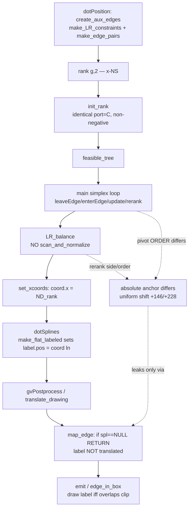

# x-coord pipeline and the anchor leak

The relative solution out of B is identical port vs C (final coords conformant
after E). The absolute anchor (X) differs and is invisible everywhere EXCEPT the
untranslated spline-less label at E1→F. Batch 1 fixes B3/B4 pivot order so X→0;
Batch 2 wires D/E1/F faithfully.
