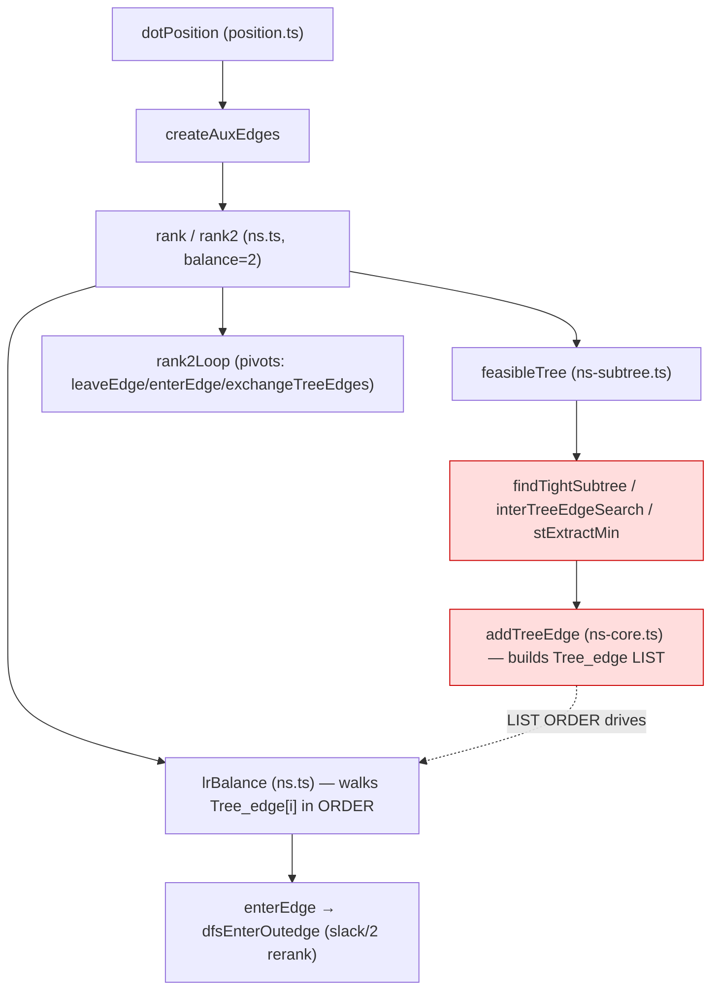

<!-- SPDX-License-Identifier: EPL-2.0 -->
# x-coord NS call chain (where the divergence lives)

**Red = fix surface.** The base optimum and lim numbering match C; the
`Tree_edge` list ORDER (set by `addTreeEdge` call sequence during the subtree
merge) does not, so `lrBalance` reranks degenerate edges in a different order and
selects a different optimal vertex. Fix the merge order so `addTreeEdge` fires in
C's sequence.
