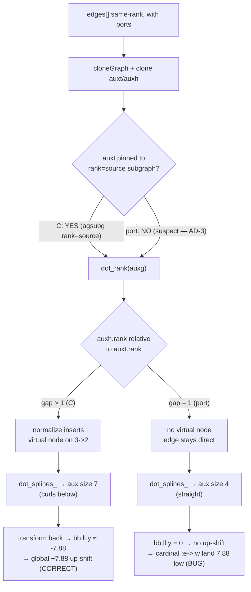
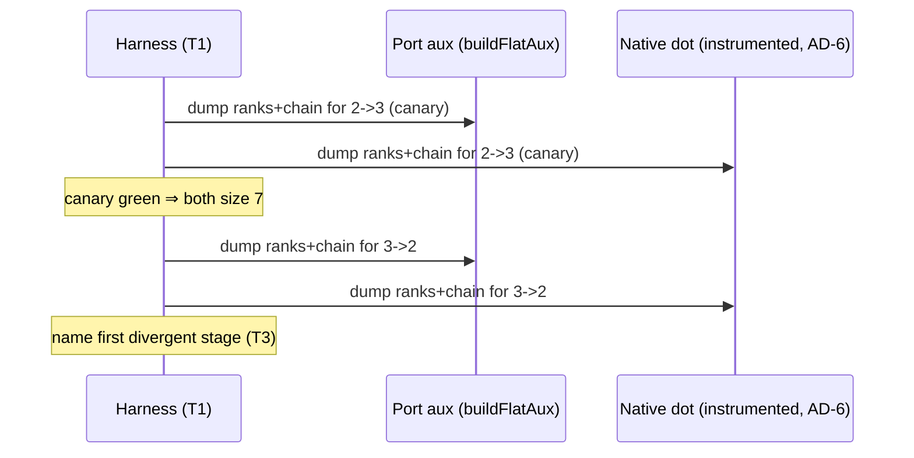

# Data flow — flat-adj aux pipeline & where the curl is decided

The flat-adj aux pipeline (C `make_flat_adj_edges` / port `makeFlatAdjEdges`).
The curl is decided at **dot_rank**, not at the spline.

Diagnosis order (this mission): confirm the **R2** branch divergence by dumping
both sides (T3), after ruling the **S** input in/out (T2), using a
canary-validated harness (T1). The fix (restore the C branch in the port) is a
**separate** mission (AD-1).

