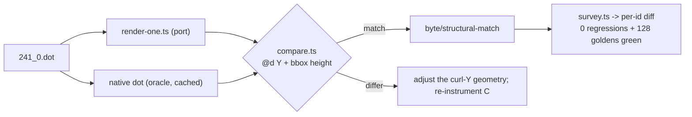

# Flat-edge curl-Y — data flow

## Two flat code paths, one Y/curl symptom

```mermaid
flowchart TD
  A["dot: same-rank edge with compass ports"] --> B{"rank-adjacent?"}
  B -->|yes 2<->3| C["make_flat_adj_edges (aux-graph clone)<br/>splines-flat.ts:266 (T2)"]
  B -->|no 5..8, 1..6| D["routeFlatEdgeFaithful (TOP/bottom boxes)<br/>splines-flat.ts:462 (T1)"]
  C --> E["aux spline -> copyFlatSplines / repositionFlatAux"]
  D --> F["topBoxes/bottomBoxes (stepy stack) -> routeSplines"]
  E --> G["ED_spl control points"]
  F --> G
  G --> H['emit -> d="M.. C.."']
  F -. "DIVERGENCE: curl Y-extent short (peak -83 vs -90)" .-> F
  E -. "DIVERGENCE: curl below missing (straight vs +1.79)" .-> E
  H --> I["bbox height: port 79 vs oracle 86 (~7pt short)"]
```

AD-5: the flat-edge X already matches C (internal +27 frame offset compensates);
diagnose Y only. T1 dumps C vs port for the non-adjacent path, T2 for the
adjacent path; T3 fixes the isolated cause(s).

## Verification loop (per task)


