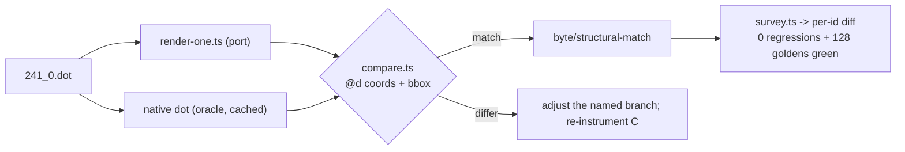

# Flat-edge routing — data flow

## Where a same-rank (flat) compass-port edge is routed

```mermaid
flowchart TD
  A["dot: same-rank edge tail->head with compass ports"] --> B["compass endpoints (DONE)<br/>compass-port.ts (correct)"]
  B --> C{"adjacent in rank order?"}
  C -->|yes| D["makeFlatAdjEdges<br/>splines-flat.ts:266"]
  C -->|no| E["makeFlatEdge<br/>splines-flat.ts:310"]
  E --> F{"top or bottom ports?"}
  F -->|ne/nw etc.| G["topBoxes<br/>splines-flat.ts:359"]
  F -->|se/sw etc.| H["bottomBoxes<br/>splines-flat.ts:379"]
  G --> I["makeFlatEndBox -> routeSplines"]
  H --> I
  I --> J["ED_spl control points"]
  J --> K['emit: svgEdgePath -> d="M.. C.."']
  G -. "DIVERGENCE: box geometry / curl<br/>(straight vs curl, wrong y-offset)" .-> H
```

T1 dumps C vs port at the box stage (G/H/I) for `3:sw->2:se`, `1:se->6:sw`,
`5:ne->8:nw` to pin the FIRST divergence — the fix target.

## Verification loop (per task)


