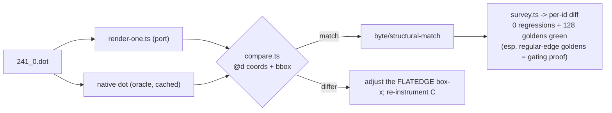

# FLATEDGE end-box x-placement — data flow

## Where the flat-end box x is set

```mermaid
flowchart TD
  A["make_flat_edge (non-adjacent)<br/>splines-flat.ts"] --> B["makeFlatEndBox<br/>splines-flat.ts:339"]
  B --> C["maximalBbox (full node x-extent)<br/>edge-route-faithful.ts:123"]
  B --> D["beginPath / endPath (FLATEDGE)<br/>splines-path-begin.ts / -end.ts"]
  D --> E["end-box x = coord.x +/- rw/lw  (PORT, node EDGE)"]
  E -. "DIVERGENCE: C uses coord.x (node CENTRE)" .-> F["correct: coord.x"]
  F --> G["routeSplines through the corrected corridor"]
  G --> H['emit: svgEdgePath -> d="M.. C.."']
```

T1 instruments C `beginpath`/`endpath` FLATEDGE to confirm the centre-vs-edge
reference and pin the exact port line; the fix (T2) is FLATEDGE-gated so the
regular-edge box-x (which shares these helpers) is untouched.

## Verification loop (per task)


