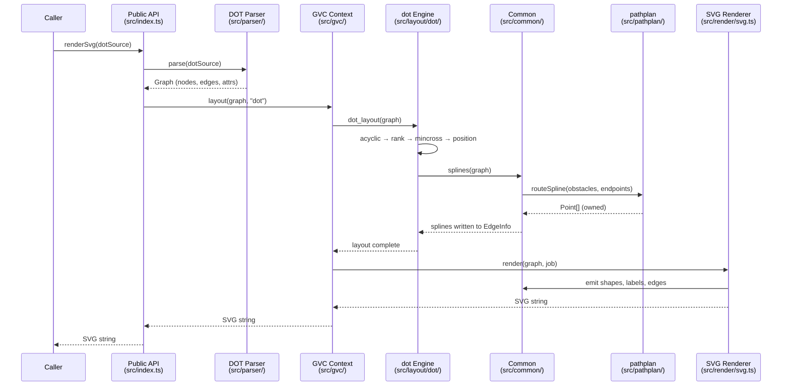
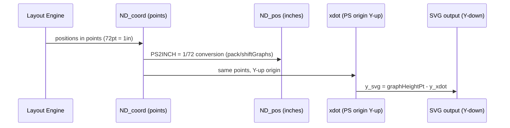

# Data Flow — dot -Tsvg

```mermaid
sequenceDiagram
    participant caller as Caller
    participant api as Public API<br/>(src/index.ts)
    participant parser as DOT Parser<br/>(src/parser/)
    participant gvc as GVC Context<br/>(src/gvc/)
    participant dotgen as dot Engine<br/>(src/layout/dot/)
    participant common as Common<br/>(src/common/)
    participant pathplan as pathplan<br/>(src/pathplan/)
    participant svg as SVG Renderer<br/>(src/render/svg.ts)

    caller->>api: renderSvg(dotSource)
    api->>parser: parse(dotSource)
    parser-->>api: Graph (nodes, edges, attrs)
    api->>gvc: layout(graph, "dot")
    gvc->>dotgen: dot_layout(graph)
    dotgen->>dotgen: acyclic → rank → mincross → position
    dotgen->>common: splines(graph)
    common->>pathplan: routeSpline(obstacles, endpoints)
    pathplan-->>common: Point[] (owned)
    common-->>dotgen: splines written to EdgeInfo
    dotgen-->>gvc: layout complete
    gvc->>svg: render(graph, job)
    svg->>common: emit shapes, labels, edges
    svg-->>gvc: SVG string
    gvc-->>api: SVG string
    api-->>caller: SVG string
```

## Coordinate Space Transitions

```mermaid
sequenceDiagram
    participant engine as Layout Engine
    participant coord as ND_coord (points)
    participant pos as ND_pos (inches)
    participant xdot as xdot (PS origin Y-up)
    participant svgout as SVG output (Y-down)

    engine->>coord: positions in points (72pt = 1in)
    coord->>pos: PS2INCH = 1/72 conversion (pack/shiftGraphs)
    coord->>xdot: same points, Y-up origin
    xdot->>svgout: y_svg = graphHeightPt - y_xdot
```
