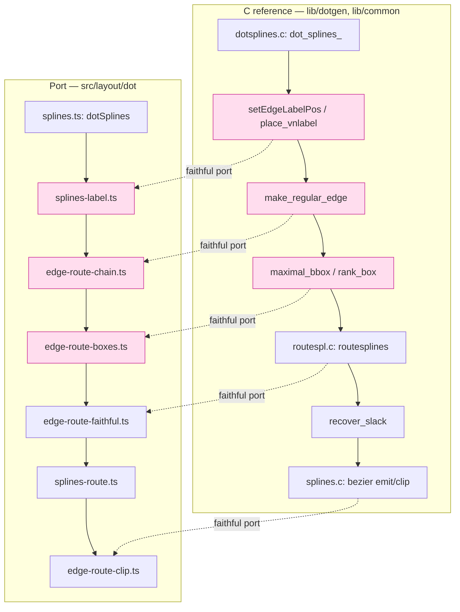

# Component map — affected spline-routing components

Pink = primary suspects (labeled-edge routing, label-node placement, box
corridor → fitter piece count). Follow the oracle; the real site may be any
node on the chain.
