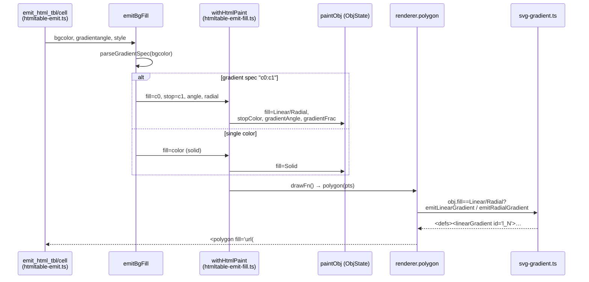

<!-- SPDX-License-Identifier: EPL-2.0 -->

# Data flow — table bgcolor → gradient emit

The dashed branch (single color) is today's only path; the gradient branch is
what T1 adds. The renderer + `svg-gradient.ts` side is already correct (proven by
conformant graph/cluster/node gradients).
