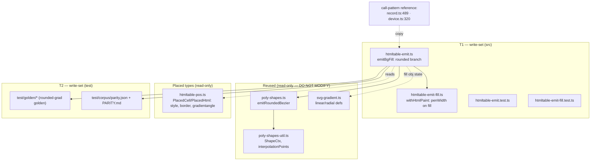

<!-- SPDX-License-Identifier: EPL-2.0 -->

# Component map — touched modules

```mermaid
graph TD
    subgraph T1["T1 — write-set (src)"]
        EMIT["htmltable-emit.ts<br/>emitBgFill: rounded branch"]
        FILL["htmltable-emit-fill.ts<br/>withHtmlPaint: penWidth on fill"]
        ETEST["htmltable-emit.test.ts"]
        FTEST["htmltable-emit-fill.test.ts"]
    end

    subgraph REUSE["Reused (read-only — DO NOT MODIFY)"]
        RB["poly-shapes.ts<br/>emitRoundedBezier"]
        UTIL["poly-shapes-util.ts<br/>ShapeCtx, interpolationPoints"]
        GRAD["svg-gradient.ts<br/>linear/radial defs"]
    end

    subgraph DATA["Placed types (read-only)"]
        POS["htmltable-pos.ts<br/>PlacedCell/PlacedHtml: style, border, gradientangle"]
    end

    subgraph T2["T2 — write-set (test)"]
        GOLD["test/golden/* (rounded-grad golden)"]
        PAR["test/corpus/parity.json + PARITY.md"]
    end

    EMIT --> RB
    RB --> UTIL
    EMIT --> FILL
    EMIT -. reads .-> POS
    EMIT -. fill obj state .-> GRAD
    EMIT --> GOLD
    EMIT --> PAR

    CALLREF["call-pattern reference:<br/>record.ts:489 · device.ts:320"] -. copy .-> EMIT
```

C spec: `emit_html_tbl` (htmltable.c:543-557), `emit_html_cell` (:644-657),
`round_corners` (shapes.c).
