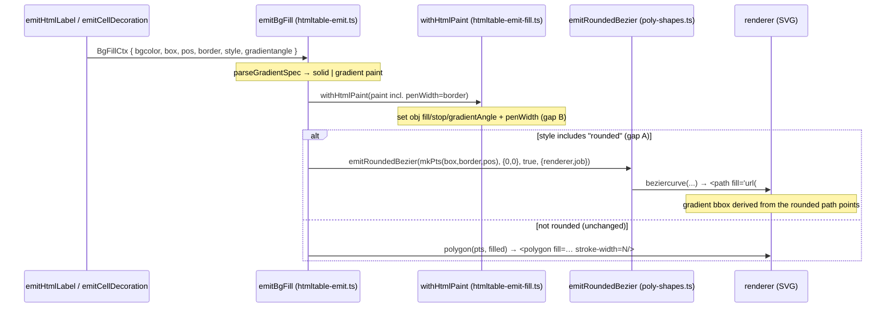

<!-- SPDX-License-Identifier: EPL-2.0 -->

# Data flow — rounded bgcolor fill emit

The gradient machinery is unchanged; only which primitive carries the fill
(`<path>` vs `<polygon>`) and the `stroke-width` attribute change. The renderer
derives the gradient `x1/x2/y1/y2` from whichever shape it is given — proven
conformant for the rounded case by `grdcluster` (a rounded gradient cluster
control).
