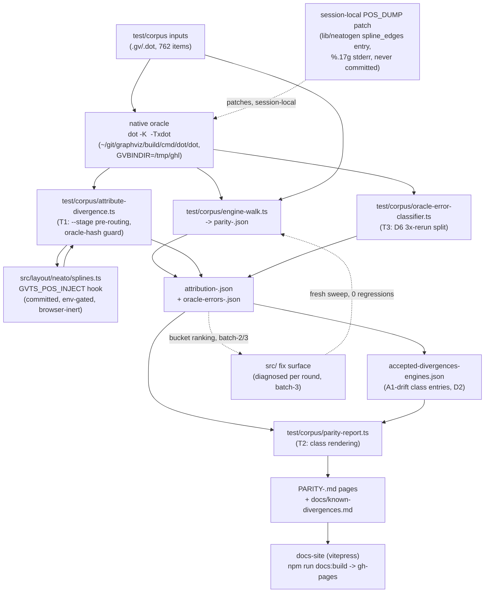

# Component Map

How corpus inputs flow through the native oracle, the injection
harness, and the reporting pipeline this mission builds.

Legend: solid arrows are data flow; dashed arrows are feedback loops
(the diagnosis→fix→re-sweep cycle in batch-3, and the session-local
native patch that is applied and reverted per injection run, never
resident in the C tree between runs).
