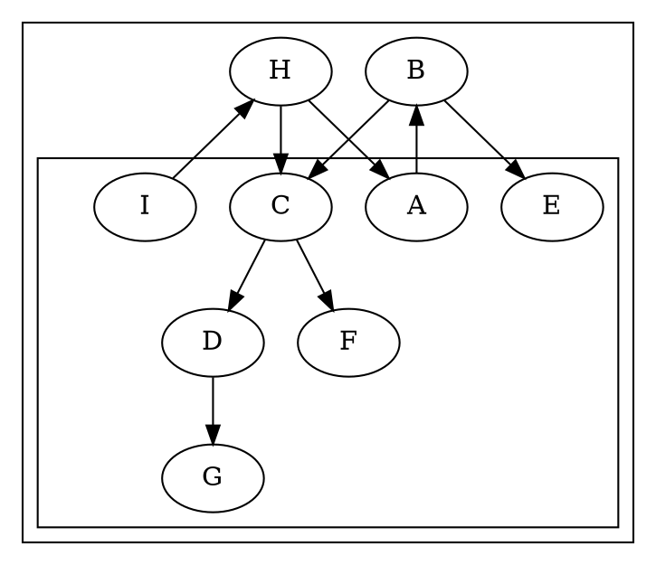

# Layout bug: 2825 — uniform +8 node y-shift in degenerate concentrate + nested clusters

**Status:** FIXED (2026-07-07) · **Kind:** layout (NOT xdot emission) ·
**Filed:** 2026-07-07
**Surfaced by:** xdot-conformance mission (the xdot renderer exposes raw
`ND_coord`; the SVG renderer masks it — see below).

## Symptom

`dot -Txdot tests/2825.dot`: **every** node's y-coordinate (`pos[1]`) is
exactly **8 units higher** in the port than in native. x-coordinates match.

| node | native y | port y | Δ |
|------|---------:|-------:|--:|
| A | 322 | 330 | +8 |
| B | 250 | 258 | +8 |
| C | 178 | 186 | +8 |
| D | 106 | 114 | +8 |
| E | 178 | 186 | +8 |
| F | 106 | 114 | +8 |
| G | 34 | 42 | +8 |
| H | 394 | 402 | +8 |
| I | 466 | 474 | +8 |
| P | 466 | 474 | +8 |

A clean, uniform +8 y-translation of the whole node set.

## Input (degenerate)



The graph is a crash-reproducer test. Layout is **degenerate**: `GD_bb =
(0,0,0,0)` on BOTH port and native, and the SVG output is an empty `8×8pt`
(just padding).

## What is confirmed (not hypothesis)

1. **This is layout, not emission.** The port's xdot emission is *faithful to
   its own layout*: probed `ND_coord.y(A) = 330`, exactly what the port's xdot
   emits (`pos="0,330"`). The divergence is in the layout coordinate itself, not
   the serializer.
2. **The graph bb is identical** (`0,0,0,0` both sides), so the xdot y-flip
   offset (`yDir(y, offsets.Y)`, output.c:373) is the same on both sides — ruling
   out an emission-side offset difference. The +8 lives in `ND_coord`.
3. **The SVG renderer masks it.** With `bb=(0,0,0,0)`, `node_in_box` (device.ts,
   mirroring emit.c `edge_in_box`/node clip) culls every node against the
   degenerate clip, so both SVGs draw nothing → the 8-unit difference is
   invisible in SVG, and 2825 passes SVG-conformance. Only `-Txdot` (which
   writes every node's `pos` unconditionally, output.c) exposes it.

## Root cause (CONFIRMED)

**`src/layout/dot/position-ycoords.ts:167`** — `setYcoordsInitial` seeds the
bottom rank's y from the **root graph's** `GD_ht1` instead of C's
`rank[maxr].ht1`:

```ts
// port (wrong):
rankArr[maxR].v[0].info.coord.y = g.info.ht1 ?? rankArr[maxR].ht1;
// C (position.c:777):
ND_coord(rank[r].v[0]).y = rank[r].ht1;   // r = GD_maxrank(g)
```

Every node stacks upward from this bottom anchor, so any difference in the
anchor shifts the whole graph uniformly.

**Instrumented values for 2825** (`createDefaultContext().layout` then inspect):

| value | port |
|-------|-----:|
| root `g.info.ht1` (the anchor used) | **42** |
| `rank[maxR].ht1` (C's anchor) | **34** |
| difference | **8** = `CL_OFFSET` |

Native's bottom node G is at y=34 (`rank[maxr].ht1`); the port's is 42
(`GD_ht1`). Δ8 across all nodes.

**Causal chain.** `clustHt`/`clustHtSubclusters` fold each cluster's `CL_OFFSET`
(8pt) margin into the **root** `GD_ht1` (→ 42), but the root branch does NOT
propagate that into `rank[maxr].ht1` (position-ycoords.ts:123, `if (!isRoot)` —
matching C, which only propagates for clusters at position.c:862). So the two
anchors legitimately differ by the cluster margin. C anchors at
`rank[maxr].ht1` and lets the cluster/root bb `LL.y` go **negative**
(`LL.y = y(bottom) − GD_ht1`, position.c:872) — i.e. the box extends the margin
*below* the bottom node — then a final translate normalizes the drawing to
origin, shifting everyone back up. The port's override instead pre-bakes that
shift into the anchor so `LL.y` computes to 0 without a translate. For a
**non-degenerate** graph the two routes reach the same emitted coordinates, so
the override went unnoticed. On 2825 the bb is degenerate `(0,0,0,0)` → **no
translate on either side** → the port's +8 anchor offset is exposed raw in the
xdot `pos` (SVG hides it via `node_in_box` node culling).

**Provenance.** The override was introduced deliberately (commit `5b1bfb8`,
"cluster layout fixes", authored by Claude Fable 5): *"seed bottom-rank y from
graph-level ht1, which clust_ht may have expanded beyond the bare rank height."*
It is a **misport** — C uses `rank[maxr].ht1` unconditionally.

## Fix

Revert the anchor to C-faithful `rankArr[maxR].ht1` (position-ycoords.ts:167).

- 2825 → **0 xdot diffs**.
- No regression on sampled cluster graphs: clust, b7, 1865, grdcluster, 2239,
  b77, abstract (all 0). (b100's delta-10 diffs are pre-existing `%.5g`
  fp-contract noise — b100 has no clusters, so the change is a no-op there;
  verified 20 diffs both with and without the change.)
- `npm test` 2780/2780 (no unit test depended on the override).
- **SVG conformance gate: 0 regressions / 0 clip-regressions** across 788 graphs
  (rules-gate PASS; the 3 pre-existing diverged and the 1 clip-watch are
  unchanged baseline gaps — node positions did not move in SVG).
- **xdot survey: 752 conformant** (was 751); 2825 dropped off the diverged list;
  no xdot regressions. Remaining diverged: 1514 (cgraph model), pgram (parser).

## Repro / oracle

```sh
DOT=~/git/graphviz/build/cmd/dot/dot
GVBINDIR=/tmp/ghl $DOT -Txdot tests/2825.dot | grep -oE '\bA \[?pos="[^"]*"'   # native: 0,322
npx tsx test/corpus/render-one-xdot.ts tests/2825.dot | grep -oE 'A \[pos="[^"]*"' # port:  0,330
```

Driver for root-cause: dump native's `ND_coord` for each node via the
`gvplugin_dot_layout` instrumentation harness (see memory
`recover-slack-and-c-harness` / `instrument-c-before-quarantine`) and compare
the accumulation of cluster offsets step-by-step against the port.

## Scope note

Out of scope for the **xdot-conformance** mission (that mission is emission-only;
this is layout). Tracked here so it is not lost. Not an accepted/irreducible
divergence — it is a fixable layout defect.
