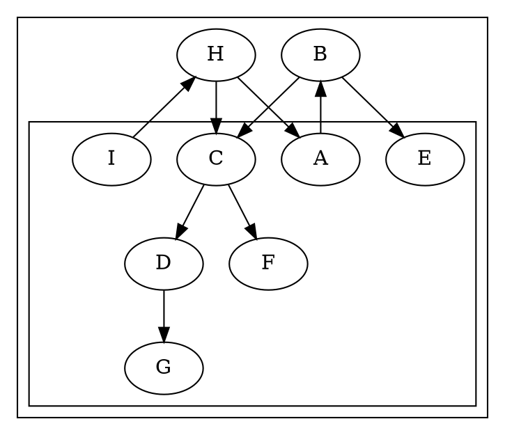

# Layout bug: 2825 — uniform +8 node y-shift in degenerate concentrate + nested clusters

**Status:** open · **Kind:** layout (NOT xdot emission) · **Filed:** 2026-07-07
**Surfaced by:** xdot-conformance mission (the xdot renderer exposes raw
`ND_coord`; the SVG renderer masks it — see below).

## Symptom

`dot -Txdot tests/2825.dot`: **every** node's y-coordinate (`pos[1]`) is
exactly **8 units higher** in the port than in native. x-coordinates match.

| node | native y | port y | Δ |
|------|---------:|-------:|--:|
| A | 322 | 330 | +8 |
| B | 250 | 258 | +8 |
| C | 178 | 186 | +8 |
| D | 106 | 114 | +8 |
| E | 178 | 186 | +8 |
| F | 106 | 114 | +8 |
| G | 34 | 42 | +8 |
| H | 394 | 402 | +8 |
| I | 466 | 474 | +8 |
| P | 466 | 474 | +8 |

A clean, uniform +8 y-translation of the whole node set.

## Input (degenerate)



The graph is a crash-reproducer test. Layout is **degenerate**: `GD_bb =
(0,0,0,0)` on BOTH port and native, and the SVG output is an empty `8×8pt`
(just padding).

## What is confirmed (not hypothesis)

1. **This is layout, not emission.** The port's xdot emission is *faithful to
   its own layout*: probed `ND_coord.y(A) = 330`, exactly what the port's xdot
   emits (`pos="0,330"`). The divergence is in the layout coordinate itself, not
   the serializer.
2. **The graph bb is identical** (`0,0,0,0` both sides), so the xdot y-flip
   offset (`yDir(y, offsets.Y)`, output.c:373) is the same on both sides — ruling
   out an emission-side offset difference. The +8 lives in `ND_coord`.
3. **The SVG renderer masks it.** With `bb=(0,0,0,0)`, `node_in_box` (device.ts,
   mirroring emit.c `edge_in_box`/node clip) culls every node against the
   degenerate clip, so both SVGs draw nothing → the 8-unit difference is
   invisible in SVG, and 2825 passes SVG-conformance. Only `-Txdot` (which
   writes every node's `pos` unconditionally, output.c) exposes it.

## Hypothesis (not yet root-caused)

The uniform +8 is the size of the default **cluster margin** (8pt). The port
likely applies the cluster margin / origin offset one extra step (or fails to
subtract it) in the nested-cluster (`cluster_outer` ⊃ `cluster_inner`) +
`concentrate` path, when the overall bb collapses to zero. Candidate areas:
`src/layout/dot/` cluster bbox / `dot_position` / cluster-margin handling
(`GD_border`, cluster offset accumulation).

## Repro / oracle

```sh
DOT=~/git/graphviz/build/cmd/dot/dot
GVBINDIR=/tmp/ghl $DOT -Txdot tests/2825.dot | grep -oE '\bA \[?pos="[^"]*"'   # native: 0,322
npx tsx test/corpus/render-one-xdot.ts tests/2825.dot | grep -oE 'A \[pos="[^"]*"' # port:  0,330
```

Driver for root-cause: dump native's `ND_coord` for each node via the
`gvplugin_dot_layout` instrumentation harness (see memory
`recover-slack-and-c-harness` / `instrument-c-before-quarantine`) and compare
the accumulation of cluster offsets step-by-step against the port.

## Scope note

Out of scope for the **xdot-conformance** mission (that mission is emission-only;
this is layout). Tracked here so it is not lost. Not an accepted/irreducible
divergence — it is a fixable layout defect.
