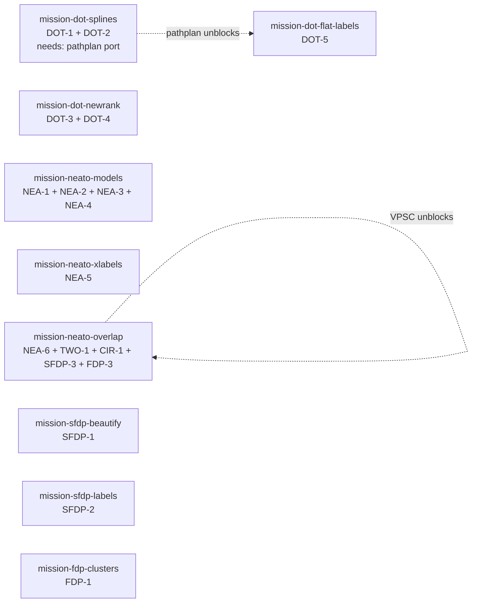

# Gap Dependency Graph

Arrows indicate "must be completed before". Independent gaps have no
incoming arrows from other gaps.

```mermaid
flowchart TD
    %% Pathplan dependency cluster
    PP[pathplan port<br/>lib/pathplan/route.c<br/>~1200 LOC new]
    PP --> DOT1[DOT-1: make_regular_edge<br/>DEFAULT reachability]
    PP --> DOT2[DOT-2: make_flat_edge<br/>ATTR rank=same + label]
    DOT1 --> DOT2

    %% dot newrank cluster
    DOT3[DOT-3: fillRanks / newrank<br/>ATTR newrank=true]
    DOT3 --> DOT4[DOT-4: expand_leaves<br/>ATTR LEAFSET cluster]

    %% dot mincross label cluster
    DOT5[DOT-5: checkLabelOrder<br/>ATTR flat labeled edges]

    %% dot nslimit - standalone
    DOT6[DOT-6: nslimit attr<br/>ATTR nslimit=N<br/>~20 LOC inline]

    %% VPSC / overlap cluster - shared infrastructure
    VPSC[NEA-6: adjustNodes VPSC<br/>lib/neatogen/adjust.c<br/>~400 LOC]
    VPSC --> TWO1[TWO-1: twopi adjustNodes<br/>~50 LOC wiring]
    VPSC --> CIR1[CIR-1: circo adjustNodes<br/>~50 LOC wiring]
    VPSC --> SFDP3[SFDP-3: sfdp prism ntry>0<br/>ATTR overlap=prism]
    VPSC --> FDP3[FDP-3: fdp removeOverlapAs<br/>DEFAULT risk if xlayout fails]

    %% neato models cluster
    NEA1[NEA-1: MODEL_CIRCUIT<br/>ATTR model=circuit]
    NEA2[NEA-2: MODEL_MDS in SGD<br/>ATTR model=mds + mode=sgd]
    NEA3[NEA-3: smart_init<br/>ATTR start=N integer]
    NEA4[NEA-4: start=regular/self<br/>ATTR start=regular/self]

    %% neato xlabels - standalone
    NEA5[NEA-5: neato xlabels<br/>ATTR xlabel= on edge]

    %% sfdp standalone gaps
    SFDP1[SFDP-1: beautify_leaves<br/>ATTR beautify=true<br/>THROWS]
    SFDP2[SFDP-2: edge_labeling_scheme<br/>ATTR label_scheme=1-4]
    SFDP4[SFDP-4: QUAD_TREE_FAST/NONE<br/>ATTR quadtree=fast/none]
    SFDP5[SFDP-5: smoothing != none<br/>ATTR smoothing=spring/etc<br/>THROWS]

    %% fdp standalone gaps
    FDP1[FDP-1: processClusterEdges<br/>ATTR compound + lhead/ltail]
    FDP2[FDP-2: PSinputscale<br/>ATTR inputscale=N<br/>~30 LOC inline]
    FDP4[FDP-4: coincident-node fallback<br/>EDGE CASE rand path<br/>~30 LOC inline]

    %% Styling
    classDef critical fill:#ff6b6b,color:#000,stroke:#c00
    classDef high fill:#ffa07a,color:#000,stroke:#d40
    classDef medium fill:#ffd700,color:#000,stroke:#aa0
    classDef low fill:#90ee90,color:#000,stroke:#060

    class PP,DOT1 critical
    class DOT2,DOT3,NEA1,VPSC high
    class DOT4,DOT5,NEA2,NEA5,NEA6,SFDP1,SFDP2,FDP1,FDP3,TWO1 medium
    class DOT6,NEA3,NEA4,SFDP3,SFDP4,SFDP5,FDP2,FDP4,CIR1 low
```

## Mission groupings

```mermaid
flowchart LR
    M1[mission-dot-splines<br/>DOT-1 + DOT-2<br/>needs: pathplan port]
    M2[mission-dot-newrank<br/>DOT-3 + DOT-4]
    M3[mission-dot-flat-labels<br/>DOT-5]
    M4[mission-neato-models<br/>NEA-1 + NEA-2 + NEA-3 + NEA-4]
    M5[mission-neato-xlabels<br/>NEA-5]
    M6[mission-neato-overlap<br/>NEA-6 + TWO-1 + CIR-1 + SFDP-3 + FDP-3]
    M7[mission-sfdp-beautify<br/>SFDP-1]
    M8[mission-sfdp-labels<br/>SFDP-2]
    M9[mission-fdp-clusters<br/>FDP-1]

    M1 -.->|pathplan unblocks| M3
    M6 -.->|VPSC unblocks| M6
```
