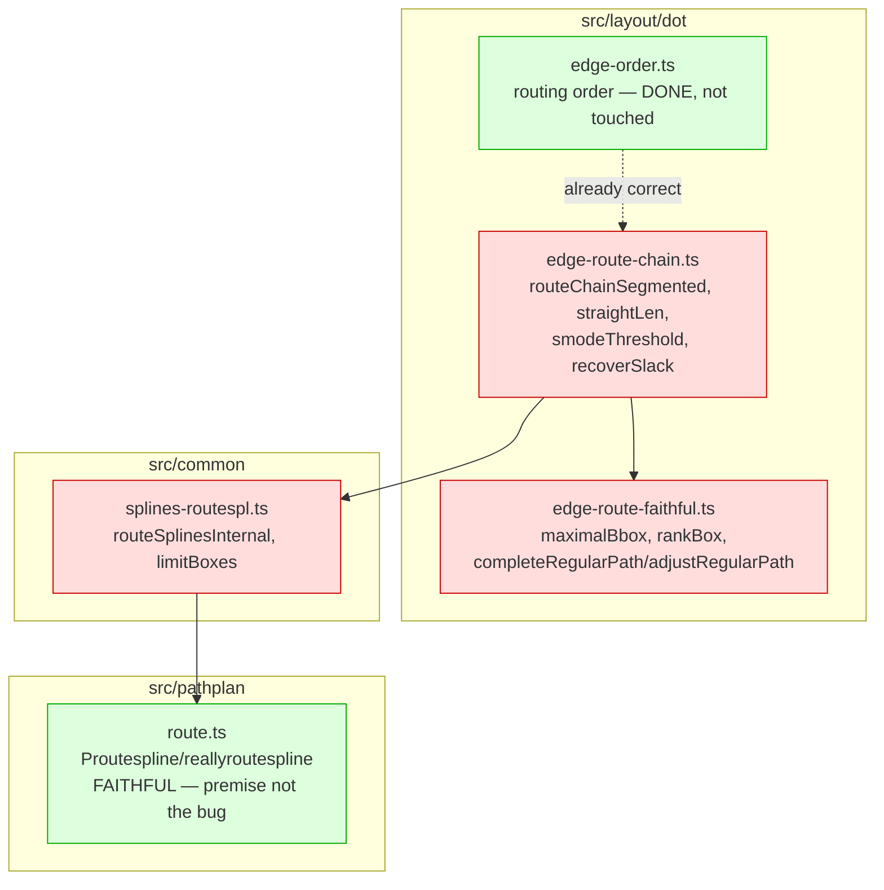

<!-- SPDX-License-Identifier: EPL-2.0 -->

# Component map — affected modules

Red = candidate fix sites (S1 picks one). Green = verified faithful / already
fixed; touch only if S1 proves the premise wrong (→ stop & re-scope).
