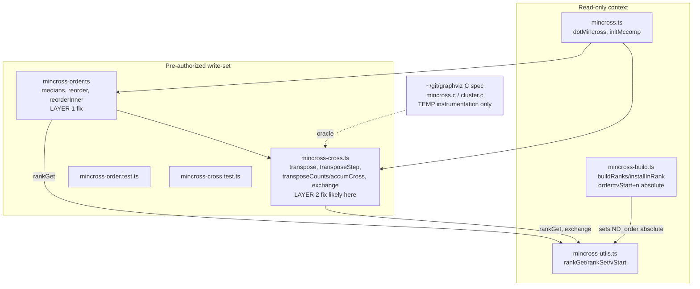

# Component map — touched modules

`mincross.ts`, `mincross-build.ts`, `mincross-utils.ts` are **read-only** — the
order/window invariant (`ND_order == absolute index`) is established there and
must hold; the fix lives only in the ordering passes.
