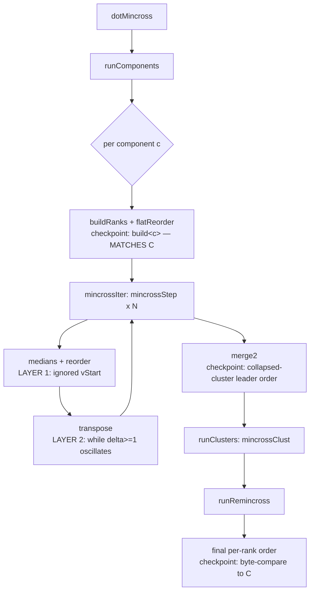

# Data flow — mincross pipeline + diagnosis checkpoints

`dotMincross` stages and where the divergence lives. Layer 1 (vStart) is in the
component-level `mincrossStep` (medians/reorder); Layer 2 (oscillation) is in
`transpose` once the component is properly reordered.



## Comparison harness (both layers)

```mermaid
sequenceDiagram
  participant TS as renderSvg (esbuild bundle)
  participant C as build/cmd/dot/dot + /tmp/gvmine
  participant D as diff
  TS->>TS: gated cdumpRanks (fingerprinted v[up>down|clust])
  C->>C: CDUMP cdump_ranks in dot_mincross (REVERT after)
  TS->>D: r&lt;n&gt;: names...
  C->>D: r&lt;n&gt;: names...
  D->>D: per-rank byte compare (real + fingerprinted virtuals)
```
