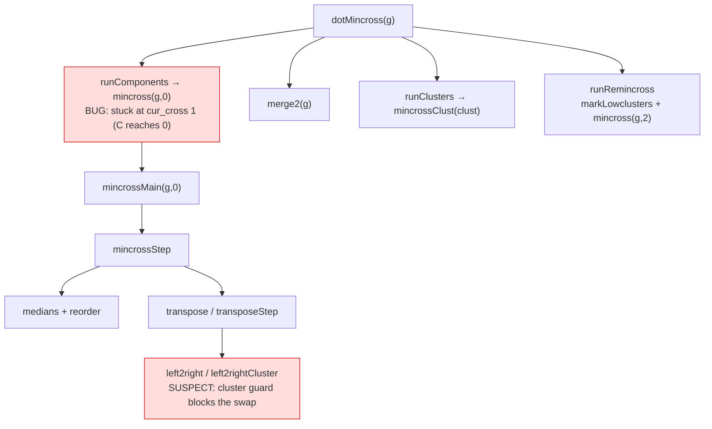

# Component map — cluster mincross

Defect is in the first root `mincross(g,0)`: the crossing-removing reorder C
makes is rejected/missed by TS. Prime suspect: `left2right` cluster contiguity
guard active too early. T1 localizes exactly.
