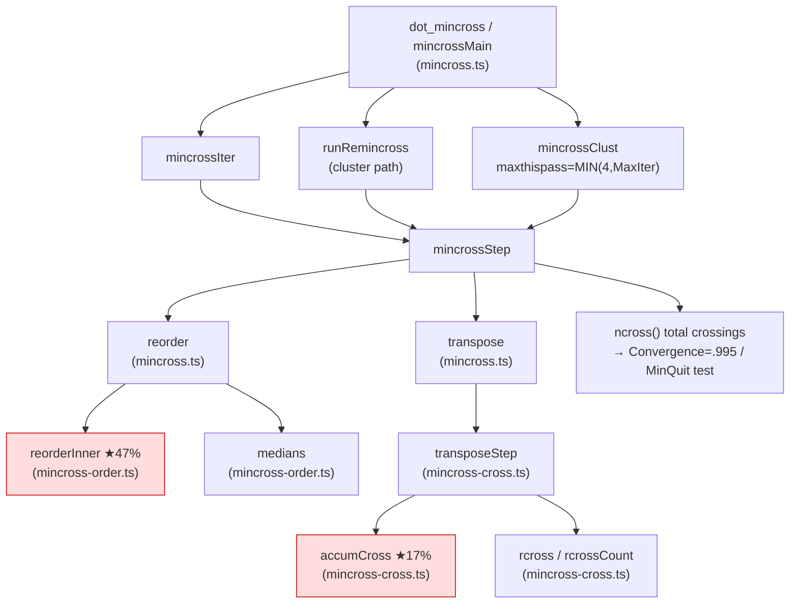
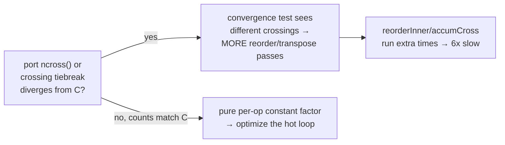

<!-- SPDX-License-Identifier: EPL-2.0 -->

# Component map — mincross hot path

Profile of 2108 (self-time): `reorderInner` 47%, `accumCross` 17%,
`interclexp` 5%, `transposeStep`/`rcross`/`cleanup1Virt`/`class1`/`medians` ≈ 11%.

## Hypothesis under test

The diagnostic (Batch 1) decides which branch is real by diffing C-vs-port
counters; Batch 2 fixes the indicated branch conformantly.
