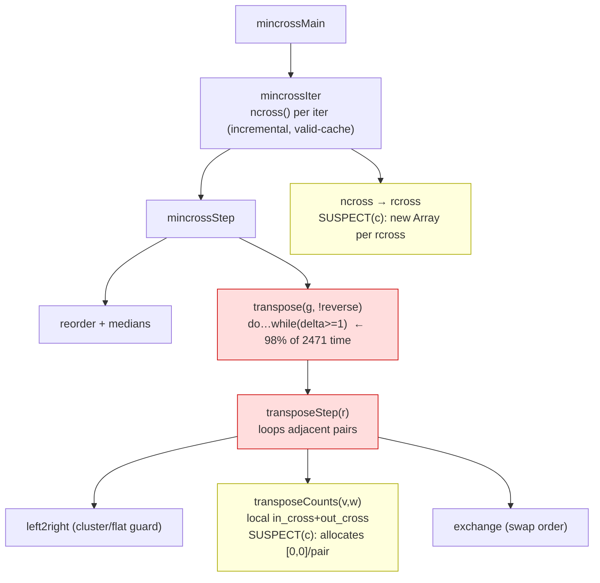

# Component map — mincross transpose hot path

The cost is inside a single `transpose()` call. Batch 1 (AD-4) determines
whether it is **pass-count** (the `do…while` runs far more passes than C),
**non-convergence** (delta never reaches 0), or **constant-factor** (the
yellow per-call allocations + megamorphic access). Per-swap scope already
matches C — `transposeCounts` is local, `ncross` is incremental.
