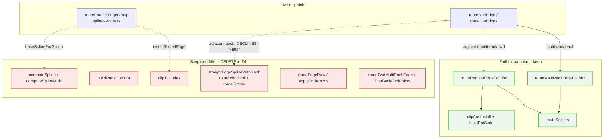
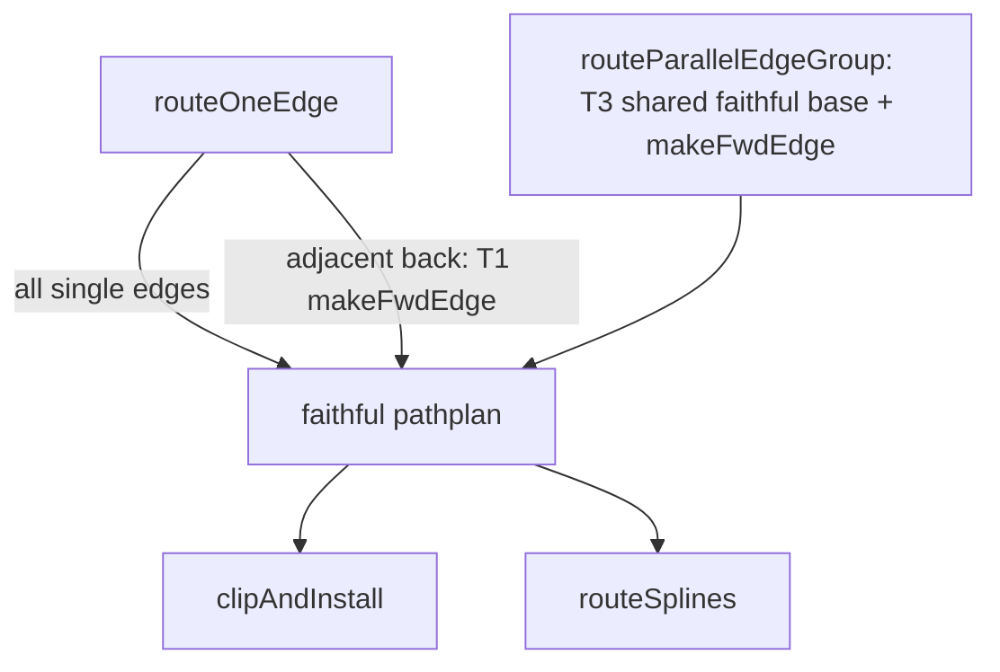

# Component map — fitter web & DOT-1b migration

Current state: the faithful path routes all single edges; the **fitter** (red)
survives in two paths (adjacent-back fallback, parallel-group router).

## Target state (after T1–T4)

| Path | Today | DOT-1b |
|------|-------|--------|
| single fwd/multi-rank/multi-rank-back | faithful | unchanged |
| adjacent back (b→a, 1 rank) | **fitter fallback** | T1 faithful |
| parallel/opposing group | **fitter** (computeSpline) | T3 faithful (mirror C) |
| fitter functions + T1 scaffolding + harness | present | **deleted (T4)** |
