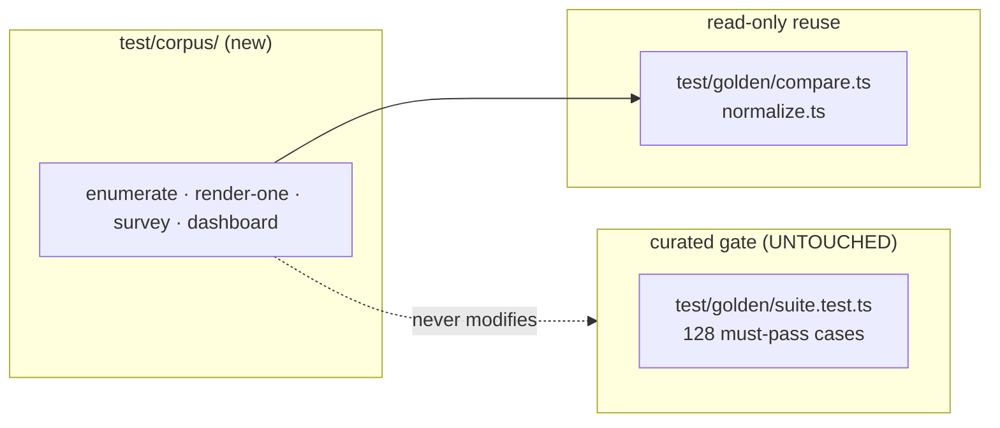

# Corpus parity survey — data flow

## Pipeline

```mermaid
flowchart TD
  C["~/git/graphviz/tests<br/>~256+ .gv/.dot"] --> E["T1 enumerate.ts"]
  E --> M["corpus-manifest.json<br/>applicable | quarantined+reason"]
  M --> S["T2 survey.ts<br/>(bounded worker pool)"]
  subgraph per["per applicable input"]
    O["spawn native dot -Tsvg<br/>(cached, gitignored)"]
    P["spawn render-one.ts<br/>timeout-killed"]
    O --> D{"compareSvg<br/>(compare.ts)"}
    P --> D
  end
  S --> per
  D -->|pass@0.01| BM["conformant"]
  D -->|numeric diffs only| SM["structural-match"]
  D -->|structural diff| DV["diverged"]
  P -.throw.-> ER["errored"]
  P -.hang.-> TO["timeout"]
  BM & SM & DV & ER & TO --> J["parity.json"]
  J --> T3["T3 dashboard.ts"]
  T3 --> R["PARITY.md<br/>summary + diverged table +<br/>triaged backlog buckets"]
  T3 --> CAT["port-catalog link"]
```

## What stays separate



The survey is a report, not a gate — hundreds of `diverged`/`errored` verdicts
are the expected, informative output, and must never turn the curated suite red.
